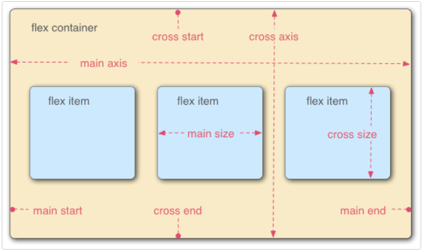
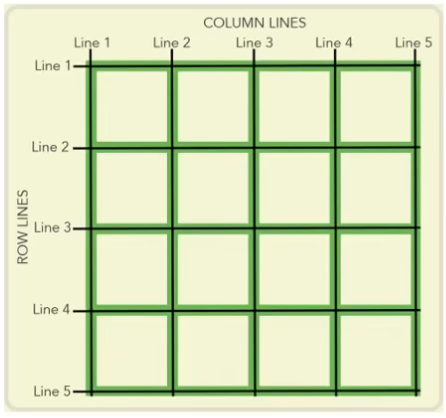

# HTML5 + CSS3

## css3 新特性

### 阴影

`box-shadow: * * * *;` - `x 轴偏移` - `y 轴偏移` - `模糊半径` - `颜色` _(不写则默认为黑色)_

### 形变 `transform: *();`

- 旋转(角度) `rotate(*);` 单位:deg
  - `transform-origin: * *;` 旋转中心坐标(x y)
- 缩放(倍数) `scale(*);`
- 位移(x, y) `translate(*, *);`

**多效果叠加**：`*() *() *();`

平移法**水平垂直居中**：

```css
position: absolute;
top: 50%;
left: 50%;
transform: translate(-50%, -50%);
```

### 过渡效果 `transition`

`-property` 过渡变化 css 属性(例如`transform` `width`)
`-duration` 过渡所用时间
`-delay` 过渡开始延迟
`-timing-function` 过渡函数

- `ease` 开始和结束缓速
- `linear` 匀速
- `ease-in` 开始缓速
- `ease-out` 结束缓速
- `ease-in-out` 开始和结束大幅缓速

**多属性同步改变简写** `transition:* * * *, 属性 时间 函数 延迟, ...;`

> 写在同一作用域 {...} 内
> 多属性不能分行，下方会覆盖上方

### 动画效果 `animation`

自动显示，完成复杂效果
定义动画：

```css
@keyframes name {
  0% {
    /* 初始状态 */
  }
  *% {
    /* 未指定100%会按百分比时间先执行后倒退 */
  }
  100% {
    /* 结束状态 */
  }
  /* 若只有开始和结束状态可简写为： */
  from {
  }
  to {
  }
}
```

> 开始和结束状态相同可使动画平滑

`animation:* * * * *;` _name 时间 函数 延迟 次数_
`-name` 绑定的动画名称
`-duration` 动画所用时间
`-timing-function` 动画速度函数
`-delay` 动画开始延迟
`-iteration-count` 播放次数

- `infinite` 循环

`-play-state: *;` 播放状态

- `pause` 暂停

(_css3 新特性_)

## flex 布局 (_弹性/弹性盒子布局_)

`display: flex;` 元素变为 flex 容器；内部元素变为 flex-item

> main axis： 主轴
> cross axis： 交叉轴
> _默认(沿主轴）横向排列，占 100%列高，不会超出容器(等比例缩放)_



### 设置 flex 容器

`flex-direction: *;` 设置 flex-item 的排列方向

- `row` **水平排列**(_默认_)
- `column` **垂直排列**
- `row-reverse` 反向水平排列
- `column-reverse` 反向垂直排列

`justify-content: *;` **flex-item 在主轴的对齐方式**

- `flex-start` 左对齐(_默认_)
- `flex-end` 右对齐
- `center` 居中对齐
- `space-between` 两端对齐(_各项目之间间隔相等，与两侧无_)
- `space-around` 各项目两侧间隔相等(_因此项目之间的间隔比项目与边框的间隔大一倍_)

`align-items: *;` flex-item 在**交叉轴**的对齐方式

- `flex-start` 不延伸；靠上
- `flex-end` 不延伸；靠下
- `center` 不延伸；居中
- `stretch` 延伸(_默认_)：项目高度未设置或设为 auto 则占满整个容器的高度

`flex-wrap: nowrap | wrap | wrap-reverse;` 换行

> flex-flow 属性是 flex-direction 属性和 flex-wrap 属性的简写形式，默认值为 row nowrap。

### 设置 flex 项目（flex-item）

`flex-grow:` **该项目填充的放大倍率**(_默认为 0_)
`flex-shrink:` **空间不足时该项目缩小倍率**(_默认为 1，值越大缩得越小；为 0 时该项目不缩小_)
`flex-basis:` **主轴排列宽度/交叉轴排列高度(固定/最小)**(_默认为`auto`；有具体单位如 px_)

> 它可以设为跟 width/height 属性一样的值（比如 350px），则项目将占据固定空间。

简写 `flex: * * *;` -grow -shrink -basis

> 该属性有两个快捷值：auto (1 1 auto) 和 none (0 0 auto)。

`align-self: *;` 单个 flex-item 交叉轴的对齐方式

| auto | flex-start | flex-end | center | baseline | stretch |
| ---- | ---------- | -------- | ------ | -------- | ------- |
| 自动 | 靠上       | 靠下     | 居中   | 基线对齐 | 延伸    |

### flex 水平垂直居中

```css
display: flex;
justify-content: center;
align-items: center; /* 容器内 */
align-self: center; /* 单个元素 */
```

(_css3 新特性_)

## grid 布局 `display: grid;`

同时布局行和列(_单元格_)；格内元素默认横向排列

### 容器内单元格设置

`grid-template-columns: * * ...;` 列宽度
`grid-template-raws: * * * ...;` 行高度
`grid-auto-rows:` 溢出行高度
`grid-auto-columns:` 溢出列宽度

> _可以直接设置像素；也可以设置填充占比，单位为 `fr`_

`justify-content: *;` 单元格在容器内水平对齐方式
`align-content: *;` 单元格在容器内垂直对齐方式

### 格内元素设置

`grid-auto-flow: column;` 单元格内元素纵向排列

`justify-items: *;` 单元格**内**元素水平对齐方式

- `start` 不延伸；靠左
- `end` 不延伸；靠右
- `center` 不延伸；居中
- `stretch` 水平延伸(_默认_)

`align-items: *;` 单元格**内**元素垂直对齐方式

- `start` 不延伸；靠上
- `end` 不延伸；靠下
- `center` 不延伸；居中
- `stretch` 垂直延伸(_默认_)

`justify-self: *;` 单个格内元素水平对齐方式
`align-self: *;` 单个格内元素垂直对齐方式

### 合并单元格 (_格内元素占格数设置_)



| 合并方式     | 元素开始**边**       | 元素结束**边**     | 简写                  |
| ------------ | -------------------- | ------------------ | --------------------- |
| **横向占格** | `grid-column-start:` | `grid-column-end:` | `grid-column: * / *;` |
| **纵向占格** | `grid-row-start`     | `grid-row-end`     | `grid-row: * / *;`    |

> _通过调整开始和结束边也可实现排列变化，如 `grid-column: 2 / 4;`_

(_css3 新特性_)

## 响应式布局

### 媒体查询 `@media *`

浏览器窗口符合一定条件实现某些样式

```css
@media screen and (*: *) and (*: *) ... {
  selector {
  }
}
```

> 利弊
> 优点：一套页面适应多端设备，提升开发效率
> 缺点：页面效果不如单独为一终端定制的页面；性能问题；维护成本高
> 总结：大部分项目不会整体采用响应式

## 移动端单位

- 绝对单位
  - px: 像素

- 相对单位
  - em: 父级元素`font-size:`值的倍数(_如父级没有则向上搜索_)
  - rem: `<html>`标签`font-size:`值的倍数；
  - vw: 相对于视口\*宽度的 1%
  - vh: 相对于视口\*高度的 1%
  - \*百分比法(_过于繁琐_)

> 用 js 设置
> 设计稿像素除以基数


