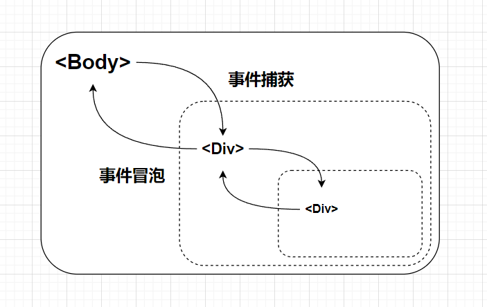
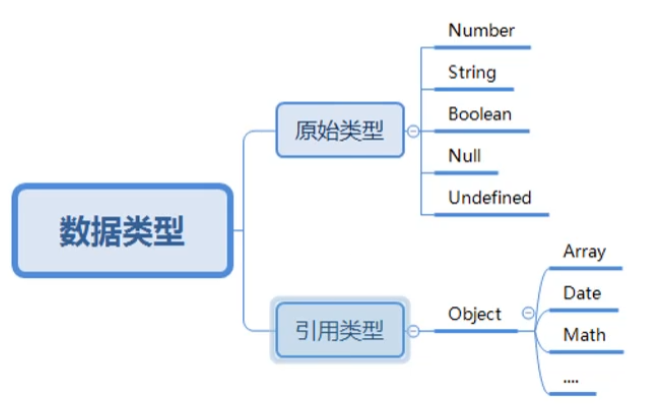

# JS

## ES6+ (_JavaScript 新的版本特性_)

### 变量 `let`

`let` 替换 `var`

- **作用于块级作用域**`{}`，外部无法访问；
- **变量声明提升**：下方定义的 `var` 上方的代码无法访问，`let`则可以；
- 重复声明：`var`会覆盖，`let`不允许重复声明。

### 常量 `const`

声明后值不可改变，对象属性可以改

- 用来声明**函数** `const myFunction = () => {}`
- 用来声明**对象**
- 用来引入**外部模块**

### 解构赋值

数组形式：`let [x, y] = [1, 2];`
`[x, y] = [y, x];` 方便值的调换

对象形式：`let {name, age} = {name:"小米", age:10};`
方便拿到属性，传递参数

```js
function getName({ name }) {
  return name
}
```

## 函数进阶

> NaN (_Not a Number_)

### 作用域链

- 外部无法访问内部作用域的变量
- 同名变量优先为当前作用域的值，否则向上一层作用域寻找值

### 立即执行函数

```js
;(function () {
  //封装函数
})()
```

(_立刻执行一次；不能重复调用_)

### 闭包

- 在一个函数中声明的函数叫做闭包函数
- 闭包：内部函数总是可以访问外部函数的参数或变量；内部函数未执行完则外部函数不会被销毁

当内部函数作为外部函数的返回值；其在最外部被调用时则仍可访问外部函数内定义的参数或变量
**用处：利用闭包实现函数封装，不会暴露不必要的参数**

> 写在立即执行函数内则为 ES5 模块化用法，ES6+ 有模块化语法，导致这种方法现在不常用

### **箭头函数**

基本语法：

- 去掉`function`关键字：`(参数) => {}`
- _函数内只有返回操作时_：(参数) `=>` 返回值

`this`关键字指向：

- 普通函数指向调用该函数的对象
- 箭头函数指向定义的父级对象

## 面向对象的语法

### ES6

支持类 使用`class`关键字

```js
class Student {
  //使用`constructor`关键字构造函数和属性
  constructor (name) {
  this.name = name;
  }
  sayName () {
    //类的方法
  }
}
//继承
class Boy extends class Student{
   constructor (name，age){
       super(name);
       this.age = age;
   }
}
```

> [参考](https://www.yuque.com/istao/inunbi/kt5526)

## DOM 基础

操作 html 元素的标准编程接口

### 获取 dom（元素/节点）

`document` 对象

元素形式(_尽量弃用_)

- `document.getElementById(" * ")`
- `document.getElementByClassName(" * ")` 集合

**选择器形式**(_尽量使用，性能更好_)

- `document.querySelector(" * ")` 只返回第一个
- `document.querySelectorAll(" * ")` 多选

可填入 `#`id `.`className 或网页标签

### 属性设置

- `*.style.css样式(驼峰命名)` 直接设置样式
- `*.src` 设置内容路径
- `*.id` 设置 id
- `*.className` 设置类名(_通常用来改变 css 样式_)

> `inp.value` 输入组件的内容

### `*.innerHTML`

设置网页元素内**所有**html 内容

```js
*.innerHTML = `
    //html内容
`
```

### 节点操作

创建元素节点：`document.createElement("网页元素")`
创建文本节点：`document.createTextNode("文本")`
添加节点：`*.appendChild(*)`
删除节点：`*.removeChild(*)`

## 事件

### 事件监听

监听事件(_多个同样事件会被覆盖，冒泡阶段触发_) `*.on+事件类型`

> `*.onclick` 点击
> `*.onmouseenter` 鼠标移入
> `*.onmouseleave` 鼠标移出
> `*.onmousemove` 鼠标移动

```js
事件 = function () {}
```

### 事件对象

`event` 作为形参放在事件函数内
`事件 = function (event) {};`

> 由于是形参所以可以任意改名，一般简写作`e`

- `e.clientX` 鼠标点击时的 x 坐标
- `e.clientY` 鼠标点击时的 y 坐标

### 事件绑定

可以同时绑定多个函数(_不会被覆盖_)，便于添加功能；可设置在捕获阶段触发

```js
*.addEventListener("事件类型", function () {

}, true/false(_默认，一般不写_))
```

### 事件流



- `false` 绑定事件默认为冒泡阶段触发(_从内到外_)
- `true` 改为捕获阶段触发

**阻止继续冒泡，避免重复触发外层事件** `e.stopPropagation();`
**取消 html 元素默认行为** `e.preventDefault();`/`return false;`

### 事件委托

根据事件的捕获和冒泡顺序，在父级元素下通过 `e.target`(_选中子级_)，将子元素的事件委托给父级处理

### 事件类型

- 鼠标事件
- 键盘事件
  - `keydown` 按下键盘
- 触屏事件
  - `touchstart` 触摸开始
  - `touchend` 触摸抬起
  - `touchmove` 按住滑动

> `e.keyCode` 键盘按键的键码

## BOM

浏览器对象模型

### `window` 对象

_全局对象_：可以不用加 `window.`

#### 计时器方法

- `setInterval` 循环执行
- `clearInterval` 暂停执行

```js
let * =setInterval(function () {
  // 功能
}, 间隔毫秒数);
clearInterval(*)
```

- `setTimeout` 延迟执行
- `clearTimeout` 取消执行

```js
let * =setTimeout(function () {
  // 功能
}, 开始延迟);
clearTimeout(*)
```

#### 防抖与节流

**防抖**：阻止高频触发

```js
let timer = null;
高频触发事件 = function() {
  if(timer !== null) {
    clearTimeout(timer);
  }
  timer = setTimeout(()=>{
    // 业务功能
    timer = null;
  },触发延迟)
```

**节流**：阻止高频，缓慢间隔触发

```js
let mark = true
事件 = function () {
  if (mark) {
    setTimeout(() => {
      // 业务功能
      mark = true
    }, 执行间隔)
  }
  mark = false
}
```

#### 弹出框

- `alert("");` 弹出消息，只能确定
- `prompt("提示", "文本框默认内容");` 文本框；值为输入内容，点取消则为 `null`
- `confirm("");` 值为布尔值，确定为 `true`,取消为 `false`

### `location` 对象

用于获得当前页面的止(URL)，并把浏览器重定向到新的页面。

- `location.href` 返回当前页面 url
  - `location.href = "..."` 页面跳转
- `location.hostname` 返回当前主机域名
- `location.pathname` 返回当前页面所在路径和文件名
- `location.port` 返回当前端口
- `location.protocol` 返回当前协议

### `navigator` 对象

包含有关访问者浏览器的信息

- `navigator.userAgent` 当前访问设备

### `screen` 对象

包含有关用户屏幕的信息

### `history` 对象

包含浏览器的历史

## 原始类型与引用类型



### 赋值区别

- 引用类型会随着被引用的属性的改变而改变

### 比较区别

- 原始类型只比较值
- 引用类型比较指向的内存空间；所以值相同却不指向同一个对象，则不等

### 传参区别

- 原始类型内部作用域的值不影响外部
- 引用类型外部会受到影响，因为内部作用域操作了其引用空间

### 类型检测

- `typeof(原始类型)` (_除了`null`，`引用类型`全检测为`object`_)
- `变量 instanceof 类型` 引用类型检测**是否**在某一类型内

> `null` 为原始类型
> 所有对象都继承于 `object`

## 异步编程

不会因为某一操作的卡顿使整体卡顿

```js
// 假数据
let target = 'hello world'
// 模拟延迟
function getData() {
  setTimeout(() => {
    return target
  }, 500)
}
// 解法1：回调函数
function getData1(fn) {
  setTimeout(() => {
    fn(target)
  }, 3000)
}
getData1((x) => {
  console.log(x)
})
//解法2：promise ES6内置对象
let p = new Promise((resolve) => {
  setTimeout(() => {
    resolve(target)
  }, 500)
})
p.then((y) => {
  console.log(y)
})
//终极解法3：async函数
async function fun() {
  let z = await getData()
  console.log(z)
}
fun()
```
