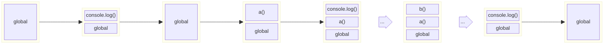

# JS 执行栈

<!-- #region demo -->

::: details 📍 JS 执行栈

```js
function a() {
  console.log('a start')
  b()
  console.log('a end')
}
function b() {
  console.log('b start')
  console.log('b end')
}
console.log('start')
a()
console.log('end')
```



:::

<!-- #endregion demo -->
