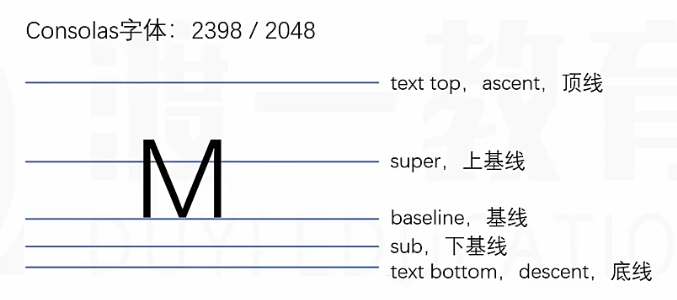
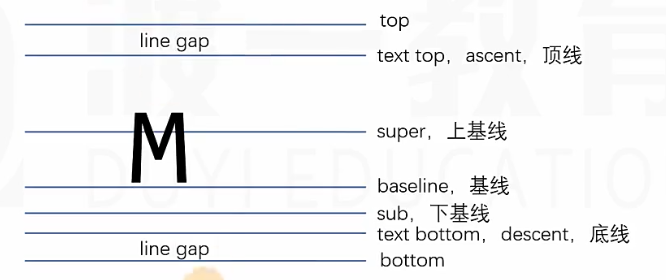

# CSS

CSS: `Cascading Style Sheets` 层叠样式表，用于定义网页的样式。

CSS规则 = 选择器 + 声明块

> 声明块： `{` `}` 中, 包含多个声明（_属性_），每个声明（_属性_）表达了某一方面的样式。

## CSS 代码位置

1. 内部样式：写在 `<style>` 元素中，通常放在 `<head>` 元素中，保证浏览器最先加载样式。
   - 样式很少时，放在内部样式中用来性能优化；浏览器只读取一个文件，提高网页的加载速度。
2. 内联样式：直接写在元素的 `style` 属性中。
3. 外部样式表：将样式表放在单独的 CSS 文件中，通过 `<link>` 元素引入，通常放在 `<head>` 元素中。
   - 可以解决多页面样式复用的问题。
   - 有利于浏览器缓存，提高网站的加载速度。
   - 有利于代码分离，便于维护。

## 选择器

用于选中元素（_样式应用的范围_）

### 简单选择器

- 元素选择器：选中对应名称的所有元素 `div`
- ID选择器：选中对应id值的元素 `#id`
- 类选择器：选中对应class值的元素 `.class`
- 通配符选择器：`*` 选中所有元素
- 属性选择器：选中具有特定属性的元素
  - `[attr]` 选中具有以 `attr` 命名属性的元素
  - `[attr=value]` 选中具有 `attr` 命名的属性且属性值等于 `value` 的元素
  - `[attr~=value]` 选中带有以 `attr` 命名的属性的元素，且属性值是一个以空格分隔的列表，其中至少有一个值为 `value`
  - `[attr*=value]` 选中带有以 `attr` 命名的属性的元素，且属性值包含 `value` 字符
- 伪类选择器：选中某些元素的某种状态
  - `:link` 超链接未访问过的状态
  - `:visited` 超链接已访问过的状态
  - `:hover` 鼠标悬停
  - `:active` 激活状态，鼠标按下
  - **注意多个伪类的书写顺序**，_爱恨法则(按以上顺序)_
- 伪元素选择器：定位 HTML 中未包含的实体以及无法以其他方式定位的内容部分（_伪元素：文档树中不存在的抽象元素_）
  - `::before` _创建一个伪元素_，它是所选元素的第一个子元素
  - `::after` _创建一个伪元素_，它是所选元素的最后一个子元素

### 选择器的组合

- 并且 `selector1selector2`
  - `a:hover`
  - `div::after`
  - `p.class-1`
  - `a[href="http://www.example.com"]`
- 后代选择：选择选中元素的后代元素中的某些元素 `selector1 selector2`
  - `div ul`
  - `.red li`
  - `.class *` _选择所后代_
- 子元素选择：选择选中元素的直接子元素 `selector1 > selector2`
- 相邻兄弟选择：选择选中同一个父元素下的下一个**紧跟**选中的兄弟元素 `selector1 + selector2`
- 兄弟选择：选择选中元素后的**所有**符合的兄弟元素 `selector1 ~ selector2`

### 选择器的并列

多个选择器之间用 `,` 分隔，表示属性同时应用于多个选择器

## 层叠

_声明冲突_：同一个样式多次应用到同一个元素

层叠（_权重计算_）：解决声明冲突的过程（_由浏览器处理_）

1. 比较重要性
2. 比较特殊性
3. 比较源次序

### 重要性

作者样式表中的 `!important` 样式 > 作者样式表中的普通样式 > 浏览器默认样式表中的样式

> _作者样式表：开发者书写的样式_

### 特殊性

总体规则：选择器选中的范围越窄越特殊

**具体规则**：通过选择器计算出一个4位数的权重（_满256进位_）

1. 千位：如果是内联样式则记 `1` 否则记 `0`
2. 百位：所有ID选择器的数量
3. 十位：所有类选择器、属性选择器、伪类选择器的数量
4. 个位：所有元素选择器、伪元素选择器的数量

### 源次序

源代码中书写顺序靠后的覆盖代码书写顺序靠前的样式

### 层叠的应用

1. 重置样式表：书写一个（_通用_）作者样式表，覆盖浏览器默认样式
2. _爱恨法则_：特殊性相同，按照交互逻辑的效果，利用源次序来达到想要的效果

> 常用的CSS重置样式表： [normalize.css](https://github.com/necolas/normalize.css/) [reset.css](https://www.joshwcomeau.com/css/custom-css-reset/) [meyer.css](https://meyerweb.com/eric/tools/css/reset/)

## 继承

子元素会继承父元素的**某些**属性，通常和字体、文字内容相关的属性都会被继承。

## 属性值的计算过程

> 浏览器渲染页面时，按照页面文档的树型目录结构，从上到下，从左到右依次渲染

浏览器渲染每个元素的前提条件：该元素的**所有css属性**都必须有值。

一个元素从所有css属性都没有值到全部有值的过程叫属性值的**计算过程**：

1. 确定声明值：将样式表（_作者样式表，浏览器样式表_）中**没有声明冲突**的声明，作为CSS属性的值
2. 层叠冲突：对样式表中**有声明冲突**的声明，按**层叠**规则，确定CSS的属性值
3. 继承：对仍然没有值的CSS属性，若可以继承，则**继承**父元素的属性值
4. 使用默认值：如果仍然没有值，则使用默认值(_每个CSS属性都有默认值_)

### 属性值的特殊取值

- 强制继承：`inherit`
  - 可使不能继承的属性强制使用父元素的值
- 初始值：`initial` 将该属性设置为默认值

生效时间：**在层叠时确定值为特殊值，并不会使用后续步骤**

## 盒模型

box(_CSS3 概念_): 盒子，每个元素在页面中都会生成一个矩形区域（盒子）

盒模型：规定单个盒子的规则

### 盒子类型

1. 行盒：`display:inline`（_默认值_） 的元素，在页面中不换行
2. 块盒：`display:block` 的元素，在页面中独占一行

> 浏览器默认样式表设置为块盒的元素：`容器元素`、`<H1>~<H6>`、`<p>`
> 浏览器默认样式表设置为行盒的元素：`<span>`、`<a>`、``、`多媒体元素`

### 盒子的组成部分

无论是行盒还是块盒，都由下面几个部分组成，从内到外分别是：

1. 内容 _content_
   - `width` 和 `height` 设置内容的宽高
   - 通常叫做整个盒子的**内容盒** （_content-box_）
2. 填充 _padding_：盒子边框到盒子内容的距离
   - `padding` 设置内边距
   - 填充区 + 内容区 = **填充盒** （_padding-box_）
3. 边框 _border_
   - `border` : `border-width` `border-style` `border-color`
   - 边框颜色默认为字体颜色
   - 边框区 + 填充区 + 内容区 = **边框盒** （_border-box_）
4. 外边距 _margin_：边框到其他盒子的距离
   - `margin` 设置外边距

#### `box-sizing`

默认情况下，`width` 和 `height` 设置的是内容盒的宽高，但衡量设计稿是往往是边框盒的宽高，（_CSS3_）可以使用 `box-sizing` 属性改变宽高的影响范围

- `box-sizing:content-box` (_默认值_)，宽高影响内容盒
- `box-sizing:border-box` 改变宽高的影响范围为边框盒

::: tip 常用设置

```css
* {
  margin: 0;
  padding: 0;
  box-sizing: border-box;
}
```

:::

### 行盒盒模型的特点

1. 盒子跟随内容延伸
2. 宽高由内容决定，设置的宽高无效
   - 如果需要调整盒子宽高，需要通过 `font-size`, `line-height`, `font-family` 等属性间接设置
3. 对于内边距（_填充区_），设置水平方向有效，垂直方向不会占据实际空间（_仅会影响背景_）
4. 边框同上
5. 外边距同上

### 行块盒盒模型的特点

`display:inline-block` 的盒子为行块盒

1. 不独占一行，适应行高
2. 盒模型相关尺寸设置都有效

#### 行盒空白折叠

空白折叠发生在行盒（含行块盒）内部或行盒（含行块盒）之间，无法消除

> 除非源代码紧连在一起

### 盒子溢出

当设置宽高时，内容超出盒子范围时默认可见，(_CSS3_)可以通过 `overflow` 属性（_简写属性_）设置溢出处理

- `overflow:visible` (_默认值_) 超出内容可见
- `overflow:hidden` 超出内容隐藏
- `overflow:scroll` 生成滚动条
- `overflow:auto` 自动生成滚动条

::: tip
网站标题为图片时，`H1` 元素的伪元素中用文字填写标题内容，再利用 `overflow:hidden` 隐藏文字，即实现了语义化，优化了SEO，又不影响图片的显示。
:::

### 可替换元素和非可替换元素

- 非可替换元素：大部分元素，页面上显示的结果，取决于元素的内容
- 可替换元素：少部分元素，显示结果取决于元素**属性**，如 ``, `video`, `audio`, `input`, `button`
  - 绝大部分可替换元素是行盒，但效果类似于行块盒，**所有盒模型中所有尺寸设置都有效**
  - CSS 不能完全控制其中所有的样式

::: tip
如果 `` 元素的资源链接失效，那么其特性和普通行盒相同(_无法设置宽高_)；可将其设为块盒或行块盒解决
:::

> `<input>` 等表单元素的默认字体大小为 `13.333...px`

#### 调整 `` 元素适应盒子的方式

- `object-fit:fill` _默认值_ 拉伸图片，使其完全适应盒子
- `object-fit:contain` 保持图片比例，使其完全显示，可能留有“_黑边_“
- `object-fit:cover` 保持图片比例，裁剪图片，使其完全覆盖盒子
- `object-fit:none` 保持原有尺寸

::: important
行盒中包含行块盒或可替换元素会导致行盒高度与其内部的行块盒或可替换元素无关，参见[line-box](#line-box)
:::

### `display:list-item`

设置为该属性值的盒子本质上仍然是一个块盒，但同时该盒子会附带另一个盒子；
元素本身生成的盒子叫主盒子，附带的盒子叫次盒子，次盒子与主盒子水平排列。

> `<li>` 元素的默认样式为 `display:list-item`

#### 相关属性

- `list-style-type` 设置次盒子内容的类型
- `list-style-position` 此盒子相对于主盒子的位置
- `list-style-image` 设置次盒子内容的图像
- 简写属性：`list-style: <list-style-type> <list-style-position> <list-style-image>`
  - 清空次盒子：`list-style: none`

### 最大最小宽高

当一个元素尺寸会自动变化时设置最大最小宽，可以让它不至于变得过小或过大

- `max-width` 设置最大宽度
- `min-width` 设置最小宽度
- `max-height` 设置最大高度
- `min-height` 设置最小高度

## 视觉格式化模型

视觉格式化模型（布局规则）：页面中多个盒子的排列规则，大体分为三种：

1. 常规流
2. 浮动
3. 定位

### 包含块 _containing block_

- 每个盒子都有它的包含块，包含块决定了盒子的排列区域。
- 绝大部分情况下，一个盒子的包含块为其父元素的内容盒

### 常规流

又叫文档流、普通文档流、常规文档流

- 所有元素默认属于常规流布局
- 总体规则：块盒独占一行，行盒水平依次排列

#### 常规流块盒规则

1. 水平方向上，块盒的盒子总占位**必须**刚好等于其**包含块的宽度**
   - `width:auto` _默认值_，将剩余空间吸收；`width` 吸收能力强于 `margin`
   - 若 `width`, `border`, `padding`, `margin` 水平方向计算后仍有剩余空间，该剩余空间被 `margin-right` 全部吸收
2. 垂直方向上，块盒高度默认由**内容**决定
   - `height:auto` _默认值_
3. 外边距
   - `margin:auto` 垂直方向 `margin` 为 `0`，水平方向吸收剩余空间
   - _外边距合并_：两个常规流块盒（_兄弟，父子_），**上下**外边距**相邻**，两个外边距会合并，取最大值。
4. [百分比取值](#百分比取值)

::: tip
`margin:0 -100px; width:auto` 宽度超出父元素

`height:1000px; margin-bottom:-999px;` 制作伪高
:::

### 百分比取值

- `padding`, `margin`, `width` **所有方向**的百分比相对于**包含块的宽度**
- `height` 的百分比：
  - 若包含块的高度取决于子元素（包含块高度`auto`），设置高度百分比无效
  - 若包含块的高度不取决于子元素，高度百分比相对于父元素高度

### 浮动

- `float:none` _默认值_，常规流
- `float:left` 左浮动，浮动元素向上向左依次排列
- `float:right` 右浮动，浮动元素向上向右依次排列

#### 浮动的基本特点

1. 当元素设置浮动后，必定为**块盒**(`display:block`)
2. 浮动元素的包含块(_和常规流一样_)，为**父元素的内容盒**
3. 浮动元素在包含块中浮动时会避让上文的常规流块盒元素；常规流块盒在排列时无视浮动元素
4. 行盒排列时会避开浮动元素
   - 用来实现文字环绕
5. 外边距合并不会发生

#### 浮动盒子尺寸

- `width:auto` 适应内容宽度
- `height:auto` 适应内容高度
- `margin:auto` 所有方向为 `0`
- [百分比取值](#百分比取值)

#### 更多规则

- 浮动盒子的顶边不得高于**上文**浮动盒子的**顶边**
- 若横向剩余空间无法放下浮动盒子，一则该盒子向下移动，直到具备足够的空间能容纳盒子

#### 应用场景

1. 文字环绕

   ```html
   <style>
     img {
       float: left;
     }
   </style>

   <div>
     
     <p>lorem ipsum dolor sit amet, consectetur adipiscing elit.</p>
   </div>
   ```

2. 横向排列

   <!-- @include: @demo/CSS-1-Carousel.md#demo -->

#### 清除浮动

**高度坍塌**：浮动元素脱离了常规流，常规流盒子的自动高度，在计算时不会考虑浮动元素。

- `clear:none` _默认值_
- `clear:both` 清除左右浮动，该元素必须出现在前面所有浮动盒子的下方
- `clear:left` 清除左浮动，该元素必须出现在前面所有左浮动盒子的下方
- `clear:right` 清除右浮动，该元素必须出现在前面所有右浮动盒子的下方

```html
<style>
  .float-left {
    float: left;
  }
  .float-right {
    float: right;
  }
  .clearfix {
    clear: both;
  }
</style>

<div class="container">
  <div class="float-left">float-left</div>
  <div class="float-right">float-right</div>
  <div class="clearfix"></div>
</div>
```

```html
<style>
  .clearfix::after {
    content: '';
    display: block;
    clear: both;
  }
  .float-left {
    float: left;
  }
  .float-right {
    float: right;
  }
</style>
<div class="container clearfix">
  <div class="float-left">float-left</div>
  <div class="float-right">float-right</div>
</div>
```

### 定位

定位：手动控制元素在包含块中的精准位置

1. `position:static` _默认值_，静态定位（不定位）
2. `position:relative` 相对定位
3. `position:absolute` 绝对定位，相对于最近的已定位祖先元素进行定位
4. `position:fixed` 固定定位，相对于浏览器窗口进行定位

- 一个元素只要 `position` 不为 `static`，就认为该元素是**定位元素**
- 除相对定位外，定位元素会脱离文档流
  - 文档流中的元素摆放时，会忽略脱离文档流的元素
  - 文档流中元素计算自动高度时，会忽略脱离文档流的元素

#### 相对定位

元素不脱离文档流，让元素在原位置的基础上进行**偏移**，不会对其他盒子造成任何影响

- `left` 距离原位向右的偏移
- `right` 距离原位向左的偏移
- `top` 距离原位向下的偏移
- `bottom` 距离原位向上的偏移

> 尽量避免设置冲突，出现冲突时，以左和上为准

#### 绝对定位

- 从父元素开始，寻找祖先元素中第一个定位元素，该元素的**填充盒**（_padding-box_）作为包含块
- 如果找不到祖先中的定位元素，则以**整个网页**（_初始包含块 initial containing block_）作为包含块
- 宽高为 `auto` 时, 适应内容宽高
- `margin:auto` 时，自动吸收剩余空间
- 一定为块盒
- 一定不是浮动
- 没有外边距合并

位置设置：

- `left` 距离包含块左边界的距离
- `right` 距离包含块右边界的距离
- `top` 距离包含块上边界的距离
- `bottom` 距离包含块下边界的距离

#### 固定定位

- 固定定位的元素的包含块固定为**视口**（_viewport 浏览器可视窗口_）
- 其他同绝对定位

::: tip
当元素祖先的 `transform`、`perspective`、`filter` 或 `backdrop-filter` 属性非 `none` 时，容器由视口改为该祖先。
:::

### 块级格式化上下文

_Block Formatting Context_，简称 BFC。

- 它是一块**独立**的**渲染区域**，规定了在该区域中[常规流块盒的布局](#常规流块盒规则)
- 它由某个 HTML 元素创建，以下元素会在其内部创建 BFC 区域
  1. 根元素 `<html>`
  2. 浮动和绝对（固定定位）定位元素
  3. `overflow` 非 `visible` 的块盒
  4. _表格元素_
  5. _行块盒_
- 不同的 BFC 的元素，渲染时互不干扰；创建 BFC 的元素，隔绝了其内部和外部，内部渲染不会影响外部

#### BFC 具体规则

1. 创建 BFC 的元素，其 `height:auto` 需要考虑内部的浮动元素（_为了隔绝内部和外部_）
2. 创建 BFC 的元素，其边框盒会避开与浮动元素重叠
3. 创建 BFC 的元素，不会与其子元素的上下外边距合并；即两个不同 BFC 的子元素上下外边距不会合并

```html
<!-- BFC 解决高度坍塌 -->
<style>
  .container {
    /* position:absolute; */
    /* float: left; */
    /* 副作用最小的方式：改变overflow属性 */
    overflow: hidden;
  }
  .float-item {
    float: left;
  }
</style>
<div class="container">
  <div class="float-item"></div>
</div>
```

### 堆叠上下文 _stack context_

一块区域，这块区域由某个元素创建，它规定了给**区域中**的内容在 z 轴上排列的顺序

#### 创建堆叠上下文的元素

1. `<html>` 元素
2. **设置了 `z-index` 数值（_非 `auto`_）**的定位元素

#### 同一个堆叠上下文中的排列

从下到上（从后到前）的顺序：

1. 创建堆叠上下文元素的背景和边框（_创建堆叠上下文的元素永远在最后_）
2. 堆叠级别（_stack level_）为负值的堆叠上下文（_设置 `z-index` 即创建新的堆叠上下文_）
3. 常规流非定位块盒
4. 非定位的浮动盒子
5. 常规流非定位行盒
6. 任何 `z-index:auto` 的元素或 `z-index:0` 的堆叠上下文
7. 堆叠级别为正值的堆叠上下文

> 相同 `z-index` 的元素，下文的在上
> 每个堆叠上下文独立于其他堆叠上下文，不能相互穿插

## 单位

- `px` 像素
- `em` _相对单位_，相对于父元素的字体大小的倍数

## 颜色

### 颜色值表示

1. 预设值：定义好的单词，如 `red`
2. 三原色（_红、绿、蓝_）色值：
   - RGB (_十进制_): `rgb(red, green, blue)` 每个颜色取值范围为 `0~255`
   - HEX (_十六进制_): `#RRGGBB` 每个颜色取值范围为 `00` ~ `FF`, 如果每种颜色两位都相同，可以简写为 `#RGB`
3. 三原色 + 透明通道(_alpha_)：
   - RGBA: `rgba(red, green, blue, alpha)` 透明通道取值范围为 `0~1`，`0` 为完全透明，`1` 为完全不透明
   - HEXA: `#RRGGBBAA` 透明通道取值范围为 `00` ~ `FF`

> RGBA 还可以写作 `rgb(0,0,0 / 0.5)`

## 文本

::: important

- 文本一定在行盒中，如果文字没有在行盒中，浏览器会直接生成一个行盒包裹文字，该行盒叫**匿名行盒**
- 每个元素必须有字体大小，如果一个元素没有声明字体大小，则会继承其父元素；如果没有父元素，则使用基准字号（_浏览器设置的默认字号_，通常是16px）

:::

### 文本相关属性

- `color` 元素内部文字的颜色
- `font-size` 字体尺寸大小，可以简单理解为文字的高度
- `font-weight` 字体粗细程度，需要字体适配
  - `normal` = `400` _默认值_
  - `bold` = `700`
- `font-family` 字体，
  - 可以使用多个字体以匹配不同环境
- `font-style` 字体样式，通常用于设置斜体
  - `normal` 正常
  - `italic` 斜体
- `text-decoration` 文本修饰，如下划线、删除线等
- `text-indent` 首行文本缩进
- `line-height` 行高，值越大每行距离越大
- `letter-spacing` 文字间距
- `text-align` 元素内部文字的水平排列方式

> `sans-serif` 无衬线字体，操作系统自动选择

### `text-align`

> `text-align` 对元素内行(行块)盒都生效

- `text-align:left` 左对齐
- `text-align:right` 右对齐
- `text-align:center` 居中对齐
- `text-align:justify` 除最后一行外，分散对齐
  - 可用于行块盒横向分散排列

::: tip
`text-align:justify` 使最后一行也分散对齐：使用一个行块盒占位

```css
p {
  text-align: justify;
}
p::after {
  content: '';
  display: inline-block;
  width: 100%;
}
```

:::

### 断词规则

(_CSS3中_) `word-break` 属性影响文字在什么位置被截断换行

- `word-break:normal` (_默认值_) 对于 `CJK` 字符在文字截断，非 `CJK` 字符在单词截断
- `word-break:break-all` 截断所有；对于所有字符都在文字截断
- `word-break:keep-all` 保持所有；所有字符都在单词截断

### 空白处理

(_CSS3中_) `white-space` 属性控制元素内的空白字符（空格、换行符等）的处理规则

- `white-space:normal` (_默认值_)
- `white-space:nowrap` 不换行
  - 与 `overflow:hidden; text-overflow:ellipsis;` 结合使用，可以实现**单行文本溢出显示省略号**

> `pre` 元素的 `white-space` 属性值为 `pre`，禁止空白折叠

### 行高取值

1. 像素值
2. em 单位：相对于当前元素字体大小的倍数
   - 先计算具体像素值再继承
3. 无单位数值：相对于当前元素字体大小的倍数
   - 先继承倍数在计算具体像素值
4. 百分比：同 em 单位

### 深入理解字体

#### 文字

文字是通过一些文字制作软件制作的，制作文字时会有多根参考线；不同的字体参考线不同，同种字体参考线相同；字体的参考线：

- 顶线 _text top / ascent_
- 上基线 _super_
- 基线 _baseline_
- 下基线 _sub_
- 底线 _text bottom / descent_

从顶线到底线的距离是文字的实际大小（_content area 内容区_），实际宽度取决于字体设计

- `font-size` 设置的是文字的相对大小
- 行盒的背景覆盖**内容区**

> 常用文字尺寸相对大小：1000, 1024, 2048

::: info



> Consolas 字体的相对大小 2048
> ascent ~ baseline 顶线相对基线的距离 1884
> descent ~ baseline 底线相对基线的距离 514
> ascent ~ descent 实际高度 2398
> 即当字体大小为 2048px 时，实际占据高度为 2398px

:::

#### 行高

line gap: 顶线向上延伸的空间 / 底线向下延伸的空间（_两者相等_），默认距离由字体设计者决定



- top ~ bottom 的距离叫做 **virtual-area**，即 **行高**
- `line-height:normal` _默认值_，使用文字默认 line gap

<!-- @include: @demo/CSS-4-Font.md#demo -->

> content area 一定居中
> `line-height:1` 不是一种好做法：line-gap 可能为负

#### `vertical-align`

一个元素如果子元素出现行盒，该元素内部也会产生参考线；`font-family`, `font-size`, `line-height` 确定即确定参考线

- `vertical-align:baseline` _默认值_，该元素的基线与父元素的基线对齐
- `vertical-align:super` 该元素的基线与父元素的上基线对齐
- `vertical-align:sub` 该元素的基线与父元素的下基线对齐
- `vertical-align:text-top` 该元素的 virtual-area 的 top 对齐父元素的顶线
- `vertical-align:text-bottom` 该元素的 virtual-area 的 bottom 对齐父元素的底线
- `vertical-align:middle` 该元素的中线（content area 的一半）于父元素的 `X` 字母高度一半的位置对齐
- `vertical-align:top` 该元素的 virtual-area 的 top 对齐 line-box 的 top
- `vertical-align:bottom` 该元素的 virtual-area 的 bottom 对齐 line-box 的 bottom
- `vertical-align` 为数值：相对于基线的偏移量，向上为正，向下为负
- `vertical-align` 为百分比：相对于基线的偏移量，百分比 \* 自身的 virtual-area 的高度

#### line-box

行盒（inline-box）组合起来，可以形成多行；每一行的区域叫做 line-box，line-box的 top 是该行最高的 top，bottom 是该行最低的 bottom

实际上，一个元素的实际高度（_`height:auto`_）的计算通过 line-box 计算

**line-box 是承载文字内容的必要条件**；以下情况不生成 line-box

1. 某元素中没有任何行盒
2. 某元素字体大小为 0 (_有兼容性问题_)

#### 可替换元素的基线

- 图片的基线位于图片的**下外边距边缘**
- 表单元素的基线在其内容的 bottom

#### 行块盒的基线

- 行块盒最后一行有line-box，用最后一行的的基线作为行块盒的基线
- 如果行块盒的最后一行没有行盒，则使用下外边距边缘作为基线

### 更多伪元素选择器

- `::first-letter` 选中元素中的第一个字母
- `::first-line` 选中元素中的第一行文字
- `::selection` 选中被用户选中的文本

## Web 字体和图标

### Web 字体

当用户电脑上没有所需字体时，使用户强制下载字体文件。

```css
/* 使用@font-face指令制作一个新字体 */
@font-face {
  font-family: 'CustomFont';
  /* 指定字体文件路径及格式 */
  src: url('path/to/font.ttf') format('ttf');
}
```

### 字体图标

使用网络字体文件引入自定义图标，并可以设置字体相关样式。

```html
<!-- 通过网络引入，也可下载后本地引入 -->
<link rel="stylesheet" href="path/to/iconfont.css" />
<!-- 设置字体图标类名，该类的::before伪元素将显示图标 -->
<i class="iconfont icon-name"></i>
<!-- 通过unicode编码引入 -->
<style>
  @font-face {
    font-family: 'iconfont';
    src: url('path/to/iconfont.eot');
    /* ... */
  }
  .iconfont {
    font-family: 'iconfont';
  }
</style>
<i>&#xe600;</i>
```

## 背景

### 背景颜色

`background-color` 属性用于设置元素的背景颜色

### 背景图

#### 使用场景

- `` 元素属于 HTML 概念，而背景图属于 CSS 的概念
- 当图片属于网页内容时，必须使用 `` 元素
- 当图片仅用于美化页面时，必须使用背景图
- 背景图可与背景颜色配合使用

#### `background-image`

`background-image:url(image.jpg)` 设置背景图片 _文件路径相对于CSS文件位置_

#### `background-repeat`

控制背景图重复方式，默认情况下，背景图会在横坐标和纵坐标中进行重复

- `background-repeat:repeat` _默认值_ 重复
- `background-repeat:no-repeat` 不重复

#### `background-size`

控制背景图的尺寸

- `background-size:auto` _默认值_ 背景图的尺寸由图片本身决定
- `background-size:cover` 背景图完全覆盖元素，比例不变，可能裁剪部分图片
- `background-size:contain` 完整显示背景图，比例不变，可能不完全覆盖元素
- `background-size:100px 100%` 宽度为 `100px`，高度为 `100%`

#### `background-position`

控制背景图的位置，预设值：`top` `center` `bottom` `left` `right`

- `background-position:center` 横向纵向居中
- `background-position:top left` 纵向靠上 横向靠左
- `background-position:10px 20px` 背景图左边距离左边界为 `10px`，上边距离上边界为 `20px`

#### `background-attachment`

控制背景图是否固定

- `background-attachment:scroll` _默认值_ 背景图随元素一起滚动
- `background-attachment:fixed` 背景图相对于视口固定

### 背景覆盖范围

默认情况下，背景覆盖边框盒，通过 `background-clip` 属性可以改变背景覆盖范围。

- `background-clip:border-box` (_默认值_) 背景覆盖边框盒
- `background-clip:padding-box` 背景覆盖填充盒
- `background-clip:content-box` 背景覆盖内容盒

### 雪碧图 _sprites_

> 也叫精灵图

- 将多个小图片拼接合并成一张图片，减少文件和请求次数，提高渲染效率
- 调整 `background-position` 属性和容器宽高，将小图标取出，放置在合适的位置

### `<body>` 元素的背景

#### 画布 _canvas_

- 渲染元素的一块区域
- 最小宽度为视口宽度
- 最小高度为视口高度
- `<html>` 元素的背景覆盖画布

#### `<body>` 背景颜色

- 如果 `<html>` 元素有背景，则 `<body>` 元素背景颜色正常（_覆盖边框盒_）
- 如果 `<html>` 元素没有背景，则 `<body>` 元素背景颜色覆盖画布

#### `<body>` 背景图片

- 如果 `<html>` 元素有背景，则 `<body>` 元素背景图片正常（_覆盖边框盒_）
- 如果 `<html>` 元素没有背景，则 `<body>` 元素背景图片覆盖画布
  - 此时 `<body>` 背景图的宽度百分比，相对于视口
  - 此时 `<body>` 背景图的高度，相对于 `<html>` 元素高度
  - `background-position` 横向的预设值/百分比取值，相对于视口
  - `background-position` 纵向的预设值/百分比取值，相对于 `<html>` 元素高度

## 常用效果

### 居中

盒子在其包含块内居中

#### 行盒（行块盒）水平居中

- 设置父元素 `text-align:center`

#### 常规流块盒水平居中

- 定宽
- 设置左右 `margin` 为 `auto`

#### 绝对定位元素水平居中

- 定宽
- 设置 `left`, `right` 为 `0` (_不设置的值会为 `auto`，吸收剩余空间_)
- 设置左右 `margin` 为 `auto`

#### 单行文本垂直居中

- 设置 `line-height` = 内容盒高度

#### 行块盒或块盒内多行文本的垂直居中

- 没有完美方案，设置盒子上下内边距相同

#### 绝对定位的垂直居中

- 定高
- 设置 `top`, `bottom` 为 `0`
- 设置上下 `margin` 为 `auto`

### 行盒的垂直对齐

#### 多个行盒垂直方向对齐

为没有对齐的额行盒设置 `vertical-align` 属性

- 数值：如 `1px`
- 百分比
- 预设值 `top`, `middle`, `bottom`, `text-top`, `text-bottom`, `super`, `sub`, `baseline`

#### 图片底部白边

图片父元素为块盒且高度自动时，图片底部和父元素之间有一条白边（_图片基线与父元素基线对齐_）

解决方案（_使父元素不产生line-box_）：

1. 设置父元素字体大小为 `0`，（_有副作用_）
2. 将图片设置为块盒

### 图片保持原清晰度

公式：图片样式尺寸 \* 缩放倍率（_浏览器 + 系统_）= 图片实际尺寸

### 盒子隐藏

- `display:none` 不生成盒子
- `visibility:hidden` 生成盒子，从视觉上移除盒子，但仍占据空间

### 设置透明度

- `opacity` 属性：设置整个元素（_包含内容_）的透明度，取值范围 `0~1`，`0` 为完全透明，`1` 为完全不透明
- [在颜色位置设置 `alpha` 通道](#颜色值表示)

### 设置鼠标样式

- `cursor:auto` _默认值_ 由浏览器控制
- `cursor:pointer` 手型
- `cursor:url('path/to/image'),auto` 设置鼠标为自定义图片，若浏览器不支持自定义鼠标，则由浏览器控制

### 外边框

- `outline` 外边框，不占据空间
- `outline-outset` 外边框偏移量

### 表单元素美化

#### 伪类及伪元素

- `:focus` 伪类：元素聚焦时的样式
- `:checked` 伪类：单选或多选被选中的样式
- `:disabled` 伪类：禁用状态的样式
- `::placeholder` 伪元素：提示文字样式

#### 输入框内部边距

- `padding`
- `text-indent` 首行缩进，可设置输入框开头缩进距离

#### 多行文本框尺寸调整

- `resize` 属性：是否可调整尺寸
  - `resize:none` 不可调整
  - `resize:both` _默认值_，可调整宽高
  - `resize:horizontal` 可调整宽度
  - `resize:vertical` 可调整高度

```css
/* 重置表单元素的默认样式 */
input,
textarea,
button,
select {
  border: none;
}

input:focus,
textarea:focus,
button:focus,
select:focus {
  outline: none;
  outline-offset: 0;
}
```

<!-- @include: @demo/CSS-2-DiyRadio.md#demo -->

> 表单元素通过点击聚焦，其他元素可以通过键盘 `tab` 键聚焦
> 元素的 `tabIndex` 属性：_全局属性_，设置元素的 tab 键顺序，默认值为 `0`

### 使用 `border` 制作三角形

一个宽高为 `0` 的元素，设置 `border` 样式

```html
<style>
  .triangle {
    width: 0;
    height: 0;
    border: 10px solid transparent;
    border-bottom-color: red;
  }
</style>
<div class="triangle"></div>
```

### 网页方向

开始和结束方向是相对的，左右是绝对的

- `direction` 设置开始到结束的方向
  - `ltr` _默认值_，文本从左到右
  - `rtl` 文本从右到左
- `writing-mode` 设置文本书写方向
  - 设置父元素

### 伪元素中的字符

utf-8 编码下，字符在 CSS 中的使用：`\`<十六进制数字>

## @规则

at-rule，@语句，CSS语句，CSS指令

### `@import`

`@import "<url>";` 用来导入外部样式表

### `@charset`

`@charset "UTF-8";` 告诉浏览器CSS文件使用的字符编码集，_必须写在样式文件的第一行_

## 更多伪类选择器

- `:first-child` 选中为第一个子元素的元素(_可以直接使用，但一般配合元素选择器使用_)
  - `p:first-child` 选中是 `p` 元素**且**为父元素第一个子元素的元素
- `:first-of-type` 选中为子元素的第一个某**元素类型**的元素
  - `a:first-of-type` 选中的为子元素且第一个为 `a` 的元素
- `:last-child` 选中为最后一个子元素的元素
- `:last-of-type` 选中为子元素的最后一个某**元素类型**的元素
- `:nth-child(n)` 选中父元素的第 `n` 个子元素，`n = 0,1,2,3...`
  - `p:nth-child(2n+1)` / `p:nth-child(odd)` 选中父元素的**奇数**子元素且为 `p` 元素的元素
  - `p:nth-child(2n)` / `p:nth-child(even)` 选中父元素的**偶数**子元素且为 `p` 元素的元素
- `:nth-of-type(n)` 选中父元素的子元素中第 `n` 个某**元素类型**的元素
  - `a:nth-of-type(2)` 选中父元素的子元素中第二个 `a` 元素

::: note
以上选择器会递归匹配子元素
:::

## 常见简写属性

- `padding` / `margin`
  1. `-top` `-right` `-bottom` `-left`
  2. `-top` `-left & -right` `-bottom`
  3. `-top & -bottom` `-left & -right`
  4. `-top & -right & -bottom & -left`
- `border`
- `background`: `background-image` `background-repeat` `background-position`/`background-size` `background-attachment` `background-color`
- `font`: `font-style` `font-variant` `font-weight` `font-size`/`line-height` `font-family`

## 浏览器兼容问题

### 兼容问题产生原因

1. 市场竞争
2. 标准版本变化

### 厂商前缀

产生原因：

1. 标准未发布时，各浏览器厂商发布的属性
2. 标准仍在讨论，但浏览器厂商希望先支持

常见厂商前缀：

- `-webkit-` Chrome，Safari
- `-moz-` Firefox
- `-ms-` IE
- `-o-` Opera

> 当与常规属性冲突时，满足层叠规则
> 浏览器在处理元素及样式时，当遇到无法识别的代码会直接略过

::: tip 自动添加厂商前缀
使用vscode插件 `autoprefixer`
:::

<!-- @include: @demo/CSS-3-ScrollBarStyle.md#demo -->

### CSS hack

根据不同浏览器（主要针对 IE）, 设置不同的样式和元素

- IE 中 CSS 的特殊符号
  - `*` + 属性：兼容 IE5~7
  - `_` + 属性：兼容 IE5~6
  - `\9` + 属性值：兼容 IE5~11
  - `\0` + 属性值：兼容 IE8~11
  - `\9\0` + 属性值：兼容 IE9~10
- 条件判断
  - `<!--[if IE]>something<![endif]-->`
  - `<![if !(IE)]><!-->something<!--<![endif]>`

### 渐进增强和优雅降级

两种解决兼容性的思路，会影响代码的书写风格

- 渐进增强：先适应大部分浏览器，然后针对新版本浏览器加入新的样式
  - 书写代码时，先避免有兼容性的问题的代码，完成之后再逐步加入新标准的代码
- 优雅降级：先制作完整的功能，然后针对低版本浏览器进行特殊处理
  - 先不用特别在意兼容性，完成整个功能之后，再针对低版本浏览器进行处理

> [Can I Use](https://caniuse.com/)
