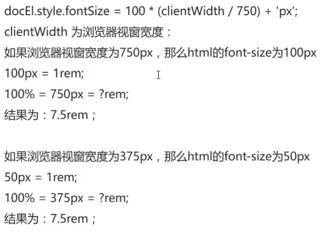

# HTML5 + CSS3 基础

HTML: `HyperText Markup Language` 超文本标记语言，用于定义网页内容。


## H5

```html
<p>段落标签，段落之间有空隙</p>
<strong>加粗</strong>或<b></b> <em>倾斜</em>或<i></i> <del>删除线</del>或<s></s> <ins>下划线</ins>或<u></u>
<div>布局（盒子），独占一行</div>
<span>跨距；分割一行</span>

<a href="目标" target="打开方式">超链接标签</a>
&nbsp;空格；&lt;小于；&gt;大于；
```

`#name`锚点链接(_配合标签`id="#"`定位网页位置_)，`#`空链接(返回顶部)

> 相对路径：`/`下一级；`../`上一级；绝对路径：`\`
> 打开方式：`_self`当前标签页；`_blank`新建标签页
> _区分一下： `<br>`,`<br />`_ > `<br>`是 HTML 写法,是 XHTML1.1 的写法, 也是 XML 写法。
> `<br/>` 是 XHTML 为兼容 HTML 的写法,也是 XML 写法。HTML5 因为兼容 XHTML，所以两种写法都可以使用。
> 早期发布的 HTML 规范当中，`<br>` 与 `` 等元素是不用封闭自身的，但是这种元素造成了 HTML 规范的不严谨，于是在之后发布的 XHTML 语言中，参考了更为严谨的 XML 规范，在这些不用自身封闭的元素后加 / 来表示自行封闭，在逻辑上来讲等同于`<br>...</br>` （但是没有`</br>` 这种写法），这样一来保证了较少的代码量，二来保证了规范的严谨。

```html
<tr>
  <!--行标签-->
  <th>表头；加粗并居中</th>
  <td>单元格</td>
  <thead>
    <!--表格头部，内部必须有<tr>-->
  </thead>
  <tbody>
    <!--表格主体-->
    <td colspan="2">横向跨列合并单元格</td>
    <td rowspan="2">纵向跨行合并单元格</td>
    <!--合并后删除多余单元格-->
    <ul>
      <!--无序列表；没有顺序之分；下级只能是<li>-->
      <li>列表项</li>
      <ol>
        <!--有序列表-->
        <dl>
          <!--自定义列表；只能包含<dt>和<dd>-->
          <dt>大哥</dt>
          <dd>小弟解释大哥</dd>
          <dd>小弟下级项目</dd>
          <!--可以有多组-->
        </dl>
      </ol>
    </ul>
  </tbody>
</tr>
```

```html
<div>
  <!--表单学习-->
  <from action="url" method="提交方式" name="name">
    <label for="username">用户名</label
    ><!--(描述)标注标签;for绑定id使文字可点-->
    <input type="text" id="username" maxlength="6" placeholder="默认文字" /><!--输入最大长度-->
    <label>密码</label>
    <input type="password" id="password" maxlength="6" placeholder="默认文字" />
    <label for="man">男</label>
    <input type="radio" name="sex" id="man" value="男" checked="checked" />
    <label for="women">女</label>
    <input type="radio" name="sex" id="women" value="女" />
    <!--name表单元素的名称；单选或多选必须有同一个name值才能实现功能-->
    <!-- value表单元素值 -->
    <select>
      <option>1</option>
      <option selected="selected">0</option>
    </select>
    <label for="textarea">文本域</label>
    <textarea id="textarea" cols="10" rows="2">默认文字;（行数2；每行10个字）</textarea>
    <input type="submit" value="提交按钮名称" />
  </from>
</div>
```

**对齐属性**：`align="*"`

`input type="*"`

- `text` 文本
- `radio` 单选框
- `checkbox` 复选框

> `cellpadding`：单元格与其中内容的空白距离(px)；
> `cellspacing`：单元格之间的距离(px) `...` |<--例-->| `...`；
> `cols="10" rows="2"`行数 2；每行 10 个字

## 常用 css 属性

字体大小 `font-size`
字体颜色 `color`
宽度 `width`
高度 `height`
背景颜色 `background-color`
文本水平对齐 `text-align`
行高 `line-height`

> chrome 浏览器字体最小值 12px

## 常用 css 选择器

**网页元素选择器** `h1, p, ...`
**id 选择器**(_尽量不用_) `#id_name`
**类选择器**(_控制多个元素_）`.class_name`
**通配符选择器** `*`

## 高级 css 选择器

**层级选择器** `selector1 selector1-①`

> 会包含 1 下的所有 ① 选择器
> `selector1 > selector1-①` 仅包含下一级 ① 选择器

**组合选择器** `selector1, selector2`
**伪类选择器**（_增加某种情况下的行为_） `selector:*`

> `:hover` 鼠标移入时
> `:focus` 为鼠标焦点时

**伪元素选择器** （_增加元素、内容_）`selector::*`
`selector::before` `selector::after` 选中元素**内部**最上方和最下方

相邻兄弟选择器`+`：选中同一父元素下某元素下方紧跟的一个元素
后续兄弟选择器`~`：选中同一父元素下某元素下方所有指定元素

## css 选择器显示权重

**选择器权重优先权重高的，层级选择器相加计算**，权重相同时选择代码在下的

> id(100) > class(10) > <网页元素>及伪元素(1)
> 属性: 值 `!important;` **设置为最高权重**

## css 引入方式

嵌入式 `<head>...<style>...</style>..</head>`
内联式 `<div style=" ">...<div>` _权重大于嵌入式，尽量不使用_
**外部样式** `<head>...<link rel="stylesheet" href="*.css">...</head>`

## 盒子模型


> 如果 box-sizing 为 content-box（默认），则内容区域的大小可明确地通过 width、min-width、max-width、height、min-height，和 max-height 控制。

|        | 属性    | 子属性                     | 语法&简写              |
| ------ | ------- | -------------------------- | ---------------------- |
| 边框   | border  | -`width` -`style` -`color` | `border: * * *;`       |
| 外边距 | margin  | -top -right -bottom -left  | `margin: * * * *;`     |
| 内边距 | padding | -top -right -bottom -left  | `padding: * * * *;`    |
|        |         | -top&bottom -left&right    | `margin/padding: * *;` |
|        |         | -top&bottom&left&right     | `margin/padding: *;`   |

**容器水平居中** `margin:* auto;`
`line-height` = `height` 垂直居中

### 盒子标准宽高计算

实际宽度 = `border-left` + `border-right` + `padding-left` + `padding-right` + `width`
实际高度 = `border-top` + `border-bottom` + `padding-top` + `padding-bottom` + `height`
`box-size: border-box;` **强制指定盒子大小**：实际宽度 = `width`；实际高度 = `height`

### 外边距重叠

块的上外边距 (margin-top)和下外边距 (margin-bottom)有时合并 (折叠) 为单个边距，其大小为单个边距的最大值，这种现象称为边距折叠。

> 有设定 float 和 position=absolute 的元素不会产生外边距重叠行为。
> 有三种情况会形成外边距重叠：1.同一层相邻元素之间，除非后一个元素加上 clear-fix 清除浮动。2.没有内容将父元素和后代元素分开 3.空的块级元素

## 网页元素边距初始化

```css
* {
  margin: 0px;
  padding: 0px;
}
```

### 默认样式修改

> `list-style: none;` 去除列表默认圆点
> `list-style: inside;` 列表默认圆点在容器内
> `text-decoration:none` 去除链接下划线

**元素占浏览器页面 100%显示**(_所有父级全占页面 100%_)

```css
html,
body {
  height: 100%;
}
```

## html 元素分类

| 分类       | 特点                         | 示例                          |
| ---------- | ---------------------------- | ----------------------------- |
| 块元素     | 可以设置边框宽高，独立成行   | `h1`~`h6` `p` `div` `ul` `li` |
| 行内元素   | 不可以设置宽高，不独立成行   | `a` `span`                    |
| 行内块元素 | 可以设置边框宽高，不独立成行 | `img` `button` `input`        |

## display 属性

`display: *;` 转换网页元素类型

| `block` | `inline` | `inline-block` | `none` |
| ------- | -------- | -------------- | ------ |
| 块元素  | 行内元素 | 行内块元素     | 隐藏   |

## 浮动布局

将块元素在同一行显示，**脱离文档流**
`float: *` 设置元素浮动位置 _(一般设置`left`)_

### 清除多个浮动元素的排列错位

原理：在浮动元素之间增加空标签并设置清除浮动样式 `clear: both;`

**利用伪元素选择器**给浮动元素的**父级**增加清除浮动

```css
.clear::before,
.clear::after {
  content: ''; /* 增加空元素 */
  display: block; /* 设为块元素独占一行 */
  clear: both;
}
```

## 树状结构

根据设计稿还原 html 标签的树状结构

> 同级节点：同父节点

## css 定位 `position: *;`

| 定位方式 | 属性       | 特性                                 |
| -------- | ---------- | ------------------------------------ |
| 绝对定位 | `absolute` | 脱离文档流，以页面左上角为参照       |
| 相对定位 | `relative` | 不脱离文档流，以原布局位置为参照     |
| 固定定位 | `fixed`    | 脱离文档流，以浏览器视窗左上角为参照 |

### 坐标

`top:`, `left:`, `right:`, `bottom:`
`z-index:` **z 轴显示优先度**：(_正/负_)整数(_默认值为 0_)；数值越大在上层显示

> 无参照坐标定位不起作用
> 置顶的元素一般设为 `z-index: 999`

### 设置参照物(_子级_)

当父级标签为定位元素时，子级的**绝对定位**元素会以父级为参照

> 一般父级用相对定位

## h5 新特性

### html5 含义

- html 的第 5 个版本
- 移动端网页效果
- h5+c3+js 接口
- 手机端整屏轮播图

### 布局元素

> 有语义的 `<div>` 标签

- `<header>` 网页头部
- `<nav>` 导航栏
- `<aside>` 侧标栏
- `<article>` 文章
- `<section>` 布局的一部分
- `<footer>` 网页页脚

### 媒体标签

- `<audio>` 音频
- `<video>` 视频

**控制属性**：
`controls` 显示控制面板
`autoplay` 自动播放 _(chrome 下视频必须 `muted` 才可自动播放)_

## css3 新特性

### overflow 属性 `overflow: *;`

内容超出容器尺寸时的样式(_默认会显示_)

- `hidden` 超出部分隐藏
- `auto` 显示滚动条

### 边框圆角 `border-radius:` _(圆角半径)_

> `*;` **四个角** > `* * * *;` 左上 右上 右下 左下
> `* *;` 左上&右下 右上&左下
> **圆角半径达到边长的 50% 则为整圆**

### 阴影

`box-shadow: * * * *;` - `x 轴偏移` - `y 轴偏移` - `模糊半径` - `颜色` _(不写则默认为黑色)_

### 形变 `transform: *();`

- 旋转(角度) `rotate(*);` 单位:deg
  - `transform-origin: * *;` 旋转中心坐标(x y)
- 缩放(倍数) `scale(*);`
- 位移(x, y) `translate(*, *);`

**多效果叠加**：`*() *() *();`

平移法**水平垂直居中**：

```css
position: absolute;
top: 50%;
left: 50%;
transform: translate(-50%, -50%);
```

### 过渡效果 `transition`

`-property` 过渡变化 css 属性(例如`transform` `width`)
`-duration` 过渡所用时间
`-delay` 过渡开始延迟
`-timing-function` 过渡函数

- `ease` 开始和结束缓速
- `linear` 匀速
- `ease-in` 开始缓速
- `ease-out` 结束缓速
- `ease-in-out` 开始和结束大幅缓速

**多属性同步改变简写** `transition:* * * *, 属性 时间 函数 延迟, ...;`

> 写在同一作用域 {...} 内
> 多属性不能分行，下方会覆盖上方

### 动画效果 `animation`

自动显示，完成复杂效果
定义动画：

```css
@keyframes name {
  0% {
    /* 初始状态 */
  }
  *% {
    /* 未指定100%会按百分比时间先执行后倒退 */
  }
  100% {
    /* 结束状态 */
  }
  /* 若只有开始和结束状态可简写为： */
  from {
  }
  to {
  }
}
```

> 开始和结束状态相同可使动画平滑

`animation:* * * * *;` _name 时间 函数 延迟 次数_
`-name` 绑定的动画名称
`-duration` 动画所用时间
`-timing-function` 动画速度函数
`-delay` 动画开始延迟
`-iteration-count` 播放次数

- `infinite` 循环

`-play-state: *;` 播放状态

- `pause` 暂停

(_css3 新特性_)

## flex 布局 (_弹性/弹性盒子布局_)

`display: flex;` 元素变为 flex 容器；内部元素变为 flex-item

> main axis： 主轴
> cross axis： 交叉轴
> _默认(沿主轴）横向排列，占 100%列高，不会超出容器(等比例缩放)_


### 设置 flex 容器

`flex-direction: *;` 设置 flex-item 的排列方向

- `row` **水平排列**(_默认_)
- `column` **垂直排列**
- `row-reverse` 反向水平排列
- `column-reverse` 反向垂直排列

`justify-content: *;` **flex-item 在主轴的对齐方式**

- `flex-start` 左对齐(_默认_)
- `flex-end` 右对齐
- `center` 居中对齐
- `space-between` 两端对齐(_各项目之间间隔相等，与两侧无_)
- `space-around` 各项目两侧间隔相等(_因此项目之间的间隔比项目与边框的间隔大一倍_)

`align-items: *;` flex-item 在**交叉轴**的对齐方式

- `flex-start` 不延伸；靠上
- `flex-end` 不延伸；靠下
- `center` 不延伸；居中
- `stretch` 延伸(_默认_)：项目高度未设置或设为 auto 则占满整个容器的高度

`flex-wrap: nowrap | wrap | wrap-reverse;` 换行

> flex-flow 属性是 flex-direction 属性和 flex-wrap 属性的简写形式，默认值为 row nowrap。

### 设置 flex 项目（flex-item）

`flex-grow:` **该项目填充的放大倍率**(_默认为 0_)
`flex-shrink:` **空间不足时该项目缩小倍率**(_默认为 1，值越大缩得越小；为 0 时该项目不缩小_)
`flex-basis:` **主轴排列宽度/交叉轴排列高度(固定/最小)**(_默认为`auto`；有具体单位如 px_)

> 它可以设为跟 width/height 属性一样的值（比如 350px），则项目将占据固定空间。

简写 `flex: * * *;` -grow -shrink -basis

> 该属性有两个快捷值：auto (1 1 auto) 和 none (0 0 auto)。

`align-self: *;` 单个 flex-item 交叉轴的对齐方式

| auto | flex-start | flex-end | center | baseline | stretch |
| ---- | ---------- | -------- | ------ | -------- | ------- |
| 自动 | 靠上       | 靠下     | 居中   | 基线对齐 | 延伸    |

### flex 水平垂直居中

```css
display: flex;
justify-content: center;
align-items: center; /* 容器内 */
align-self: center; /* 单个元素 */
```

(_css3 新特性_)

## grid 布局 `display: grid;`

同时布局行和列(_单元格_)；格内元素默认横向排列

### 容器内单元格设置

`grid-template-columns: * * ...;` 列宽度
`grid-template-raws: * * * ...;` 行高度
`grid-auto-rows:` 溢出行高度
`grid-auto-columns:` 溢出列宽度

> _可以直接设置像素；也可以设置填充占比，单位为 `fr`_

`justify-content: *;` 单元格在容器内水平对齐方式
`align-content: *;` 单元格在容器内垂直对齐方式

### 格内元素设置

`grid-auto-flow: column;` 单元格内元素纵向排列

`justify-items: *;` 单元格**内**元素水平对齐方式

- `start` 不延伸；靠左
- `end` 不延伸；靠右
- `center` 不延伸；居中
- `stretch` 水平延伸(_默认_)

`align-items: *;` 单元格**内**元素垂直对齐方式

- `start` 不延伸；靠上
- `end` 不延伸；靠下
- `center` 不延伸；居中
- `stretch` 垂直延伸(_默认_)

`justify-self: *;` 单个格内元素水平对齐方式
`align-self: *;` 单个格内元素垂直对齐方式

### 合并单元格 (_格内元素占格数设置_)


| 合并方式     | 元素开始**边**       | 元素结束**边**     | 简写                  |
| ------------ | -------------------- | ------------------ | --------------------- |
| **横向占格** | `grid-column-start:` | `grid-column-end:` | `grid-column: * / *;` |
| **纵向占格** | `grid-row-start`     | `grid-row-end`     | `grid-row: * / *;`    |

> _通过调整开始和结束边也可实现排列变化，如 `grid-column: 2 / 4;`_

(_css3 新特性_)

## 响应式布局

### 媒体查询 `@media *`

浏览器窗口符合一定条件实现某些样式

```css
@media screen and (*: *) and (*: *) ... {
  selector {
  }
}
```

> 利弊
> 优点：一套页面适应多端设备，提升开发效率
> 缺点：页面效果不如单独为一终端定制的页面；性能问题；维护成本高
> 总结：大部分项目不会整体采用响应式

## 移动端单位

- 绝对单位

  - px: 像素

- 相对单位
  - em: 父级元素`font-size:`值的倍数(_如父级没有则向上搜索_)
  - rem: `<html>`标签`font-size:`值的倍数；
  - vw: 相对于视口\*宽度的 1%
  - vh: 相对于视口\*高度的 1%
  - \*百分比法(_过于繁琐_)

> 用 js 设置
> 设计稿像素除以基数


