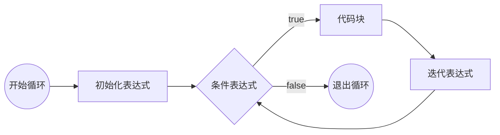
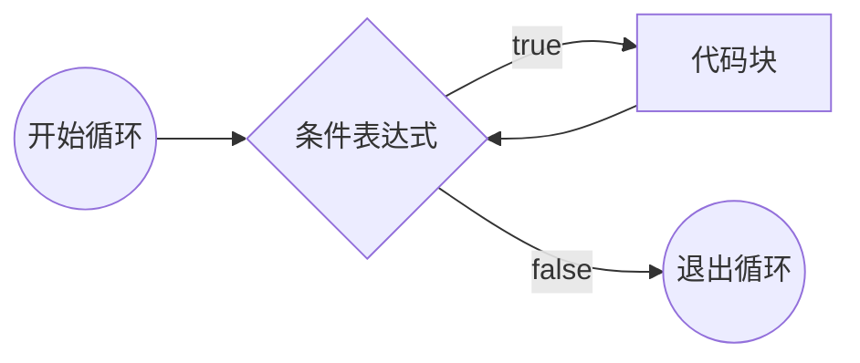
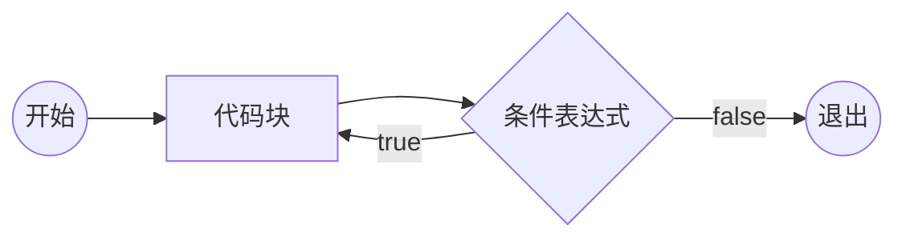

# JavaScript

## JavaScript 起源

网景公司（Netscape Communication Corporation）于 1994 年推出了第一款商用浏览器：网景（Netscape Navigator）。
1995 年，网景公司决定在浏览器中加入一门编程语言，用于实现用户交互效果，提高用户体验。
网景公司聘请 **Brendan Eich** 开发这门语言。10 天后， LiveScript 语言诞生。后来为了商业考虑，更名为 JavaScript（_JS_）。

> Java 与 JavaScript 的关系：周杰 ~ 周杰伦；葡萄 ~ 葡萄牙。

### 第一次浏览器大战

网景公司计划在浏览器中加入网络操作系统，触动了微软的利益；
1995 年微软发布 IE 浏览器，第一次浏览器大战开启。
JS 推出之后，网景取得了极大的竞争优质。
微软对 JS 进行反编译，并借鉴 JS 推出了 JScript、VBScript 两种语言，这两种语言都可以在 IE 中执行。

第一次浏览器大战是**标准之争**。

1997 年，网景将 JavaScript 1.1 版本提交给 ECMA (欧洲计算机制造协会)，希望将其标准化。
ECMA 收录了 JavaScript 并提交给 ISO；经修改成为第一个JavaScript 标准，称为 **ECMAScript**，简称 ES。

IE3 发布，并绑定 Windows 操作系统，网景市场份额不断下滑，于 1998 破产被收购。

### 第二次浏览器大战

微软推出 IE4、IE5、IE6（捆绑 Windows XP）后，微软决定解散浏览器团队。
Brendan Eich 在网景解散后，带领团队成立 Mozilla 基金会，并将网景浏览器和 JS 开源。
长时间内世界技术爱好者们对网景浏览器进行维护和修补。
2002 年 Mozilla 基金会推出 Firefox 浏览器。
2008 年 Google 推出 Chrome 浏览器；2010 年 Apple 推出 Safari 浏览器；2012 年 ASA 推出 Opera 浏览器。
Chrome 浏览器搭载了 JS 引擎 V8，可以将 JS 代码直接转换为字节码；JS 代码的执行速度大幅提升，理论上已经接近汇编语言。从此 JS 具备了编写大型应用的能力，甚至服务器应用。**V8 引擎将 JS 的执行推向了一个新的台阶。**

> Ryan Dahl 直接利用 V8 引擎完成了 node.js，使 JS 语言在服务器端可以运行。

### ES 标准的发展

1997年 -- ES1
1998年 -- ES2
1999年 -- ES3
2009年 -- ES5，从此习惯上不再区分 JavaScrip 和 ECMAScript
2015年 -- ES6 / ES2015，从 ES6 开始，使用年号作为版本号
2016年 -- ES2016
……

==ES 的语言标准不涉及语言的运行环境==；正是因为 ES 避免了运行环境，让 ES 有机会在各种环境中运行，使 ES 成为了一个通用编程语言。

通常把 ES 运行的环境称为**宿主环境**

## JavaScript 语言特性

1. JavaScript 是一种解释型语言
2. JavaScript 是一个弱类型语言
3. 单线程：上一件事情没有做完，下一件事情必须等待（_同步现象_）
4. 异步：提高单线程的执行效率

::: details 📚 编程语言分类

编译型语言：编译型语言会经过一个翻译的过程，负责编译的叫做编译器；翻译的结果叫做编译结果。

> 如 C、C++ 等；
> 优点：执行速度快；
> 缺点：某个编译结果，难以适用于各种环境（_跨平台障碍_），部署繁琐。

解释型语言：没有编译结果。

> 如 JavaScript、Php 等；
> 优点：跨平台，部署简单；
> 缺点：执行速度稍慢。

强类型语言：存放的数据类型不可变；

> 优点：严谨；缺点：灵活性差，不易上手。

弱类型语言：存放的数据类型可变；

> 优点：灵活，易上手；缺点：不严谨。

通常将弱类型的解释型语言称为 _脚本语言_ 。

:::

## JS 代码书写位置（_浏览器环境_）

1. 直接书写在页面中的 `<script>` 元素中
2. 写到外部 js 文件中，通过 `<script>` 元素的 `src` 属性引入
   - 有利于浏览器缓存
   - 有利于代码分离（_内容，样式，功能三者分离_），便于维护和阅读

::: tip

- 页面中可以存在多个 `<script>` 元素，执行顺序从上到下。
- 如果一个 `<script>` 元素使用 `src` 引入了外部代码，其内部书写的代码无效。
- `<script>` 元素的 `type` 属性可以指定代码语言；值为 MIME 类型。

:::

## 基本语法规则

- JavaScript 语法部分必须是英文符号
- JavaScript 代码由多条语句构成，语句以 `;` 结尾（_不具有强制性_）
- JavaScript 代码从上到下同步执行
- JavaScript 语言大小写敏感

### 输入输出语句

> 所有的输出输出语句都不是 ES 标准。

#### 输出语句

- `document.write()` 用于将数据输出到页面
- `alert()` 用于将数据以弹窗形式显示到页面
- `console.log()` 用于将数据输出到控制台

#### 输入语句

- `prompt("请输入：")` 用于弹出输入框，获取用户输入的数据
  - 点击取消返回 `null`
  - 点击确定返回用户输入的字符串

### 代码注释

```js
// 单行注释

/*
多行注释
*/
```

## 数据和数据类型

数据：有用的信息
数据类型：数据的分类

> 直接书写的具体数据，称为**字面量**

### JS 中的数据类型

- 原始类型(_不可再细分的类型_)
  - `number` 数字类型
  - `string` 字符串类型
  - `boolean` 布尔类型
  - `undefined` 未定义类型
  - `null` 空类型
- 引用类型
  - `object` 对象
  - `function` 函数

#### 数字类型

表示小数、整数等；书写方式：直接书写

> 数字类型可以加上前缀，表示不同的进制；不加默认为十进制。
> 前缀 `0` 表示八进制；前缀 `0x` 表示十六进制；前缀 `0b` 表示二进制。

#### 字符串类型

表示一长串文本（_0 个或多个文本_）；书写方式：

1. 单引号包裹 `'some text'`
2. 双引号包裹 `"some text"`
3. 反引号包裹（_模板字符串_）`` `some text` ``

::: tip 在字符串中表示特殊字符

使用转义符 `\` 进行转义

- `\n` 换行符
- `\t` 制表符

:::

::: tip 使用长数字还是字符串？

如果按照数字阅读则使用数字类型；否则使用字符串类型。

:::

#### 布尔类型

表示真或假；书写方式：

- `true` 真
- `false` 假

#### undefined 类型

表示未定义；书写方式：`undefined`

#### null 类型

表示空值；书写方式：`null`

#### 对象

表示事物、东西等；对象是由多个基本类型或对象组合而成

属性：对象的成员

::: details 📍 对象示例

```json
{
  name: "小明",
  age: 18,
  isStudent: true,
  address: {
    country: "china",
    province: "jiangsu",
    city: "suzhou"
  }，
  girlFriend: null
}
```

:::

### 判断数据的类型

#### typeof 操作符

返回数据的类型字符串

```js
typeof 123 // 'number'
typeof 'abc' // 'string'
typeof true // 'boolean'
typeof undefined // 'undefined'
typeof null // 'object' (_JS 特性_)
typeof {} // 'object'
```

> 函数写法： `typeof()`

## 变量 variable

变量是一块**内存**空间，用于存放数据。

### 变量的使用

- 任何可以书写数据的地方都可以使用变量
- 不可以使用一个未声明的变量，
  - 使用 `typeof` 时除外

#### 声明（定义）变量

```js
var a // 声明了一个变量，声明后变量默认为 undefined
console.log(a) // undefined
```

::: info 标识符的命名

在开发中，需要自行命名的位置，叫做标识符。

标识符的命名规则：

- 必须以字母、下划线或 `$` 符号开头
- 其他位置可以出现数字、字母、下划线或 `$` 符号
- 不可以与关键字、保留字重复

标识符命名命名规范：

- 变量名应做到望文知义
- 多个单词使用驼峰命名法

:::

#### 变量的赋值

赋值：向变量的内存空间中存放数据

```js
// 将 123 存放到变量 a 中
a = 123
```

- 变量可以被重新赋值，新的值会取代旧的值（_JS 中变量的数据类型是可变的_）
- 声明和赋值可以合并（_语法糖_）
- 多个变量可以合并声明并赋值（_语法糖_）

::: details 📍 语法糖示例

```js
var a = 1
var b = a // 将变量 a 的数据**复制**到变量 b 中
b = 2 // 不影响变量 a 的数据（原始类型）
```

```js
var a = 1,
  b = 2,
  c = 3
```

> 语法糖只是方便书写或记忆，没有实质性改变。

:::

### 变量中的对象

```js
var user = {
  account: 'abc',
  password: '123456',
  isVip: true
}
```

读取对象中的某个属性：`变量名.属性名`

::: important

- 当读取的属性不存在时，会返回 `undefined`
- 当读取的属性值不存在（_属性值为 `undefined` 或 `null`_）时，会报错

:::

更改对象变量的属性：

```js
var user = {
  account: 'abc',
  password: '123456',
  isVip: true
}
// 修改 user 对象的 password 属性值
user.password = '654321'
```

当赋值的属性不存在时会添加该属性

::: warning

```js
var user // user 为 undefined
user.name = 'shaw' // 会报错：原始类型 undefined 不可以添加属性
```

:::

删除属性：`delete 变量名.属性名`

> 实际编程时一般将属性值设为 `undefined` 以达到类似效果

#### 属性表达式

给属性属性赋值或读取属性时可以使用 `变量名["属性名"]`

属性表达式的使用场景：

1. 属性名中包含特殊字符（_不是标准标识符_）
   - 实际上 JS 对属性名的命名并不严格，属性名可以为任意格式（_字符串_）
2. 属性名为变量

```js
var prop = 'name'
user[prop] = 'shaw' // 即 user.name = 'shaw'
```

::: important

属性名只能为**字符串**
如果不是字符串（如数字），宿主环境会自动转换为字符串

```js
var obj = {
  0: 0
}
obj[0] = '零'
obj['0'] = 'zero'
console.log(obj[0]) // 'zero'
```

:::

### 变量的声明提升

**JS 中存在变量声明提升**：**所有**变量的**声明**会自动提升到代码最顶部

> JS 中允许声明多个同名变量，**声明提升后会变为一个**

### 全局对象

JS 大部分宿主环境，都会提供一个特殊的对象，该对象可以在 JS 代码中直接访问，称为**全局对象**

- 浏览器全局对象：`window` (_表示整个窗口_)
- Node.js 全局对象：`global` (_表示当前 Node.js 进程_)

==开发者定义的所有变量实际上会成为全局对象的属性；但如果变量没有被赋值，则该变量不会覆盖全局对象中的同名属性==

::: tip

- 全局对象中的所有属性可以直接使用，前面无需加上全局对象名
- 变量赋值时不写 var 关键字，相当于直接给 `window` 的某个属性赋值

```js
var console = 'abc'
console.log('hello world') // 报错：console 被覆盖为字符串
```

```js
var console
console.log('hello world') // 正常输出
console = 'abc' // 无法访问声明的 console 变量，实际访问的是全局对象中的 console 属性
```

:::

::: info `window` 中特殊的 `name` 属性

```js
var name
console.log(name) // ''
console.log(typeof name) // string
// 因为 window 对象中含有属性 name
```

```js
var name = undefined
console.log(name) // 'undefined'
console.log(typeof name) // string
// name 属性会将任何赋值特殊处理为字符串
```

> 类似还有 `status` 等属性

:::

### 引用类型变量的存储机制

- 原始类型的变量存放具体的内容到内存中

  ```js
  var a = '123'
  var b = a
  b = '456'
  console.log(a) // '123'
  console.log(b) // '456'
  ```

- 引用类型的变量会另外开辟一块新的内存空间，存放对象的内容，再将该**内存空间的地址**存放到变量中

  ```js
  var obj1 = { name: '123' }
  var obj2 = obj1
  obj2.name = '456'
  console.log(obj1.name) // '456'
  console.log(obj2.name) // '456'
  ```

  `obj1` 指向某对象（_`obj1` 持有某对象的引用_）；`obj2` 指向同一对象（_`obj2` 也持有同一对象的引用_）

==出现对象字面量的位置，都一定会在内存中开辟一个新的空间==

::: details 📍 对象的存储机制示例

```js
var user1 = {
  name: '小明',
  age: 18,
  address: {
    // 新的空间
    country: 'china'
  }
}
var user2 = {
  name: '小红',
  age: 18,
  address: user1.address
}
user2.name = '小刚'
user2.address.country = 'uk'
console.log(user1.name, user2.name) // '小明' '小刚'
console.log(user1.address.country, user2.address.country) // 'uk' 'uk'
```

:::

> 出现一对 `{}` 即为一块新的内存空间

<!-- @include: @demo/JS-1-VariableSwitch.md#demo -->

#### JS 中的垃圾回收

JS 引擎中的垃圾回收器会定期的发现内存中无法访问到的对象，该对象称之为垃圾，JS 引擎会在合适的时间将其占用的内存空间释放。

## 运算符

解决数据的运算问题

### 操作符和操作数

操作符：运算符，参与运算的符号
操作数：参与运算的数据，也称之为 _元_、_目_

::: tip

- 操作符不一定只有一个符号
- 操作符出现在不同的位置可能具有不同的含义

:::

::: details 📍 操作符示例

1. `=` 赋值符，将右边的数据赋值给左边
2. `.` 访问符，用于访问对象的属性
3. `[]` 访问符，同上
4. `()` 函数调用符

:::

### 运算符的分类

按操作数数量分类：

- 一元（_单目_）运算符
  - `()`, `.`, `[]`...
- 二元（_双目_）运算符
  - `+`, `-`, `*`, `/`, `%`, `=`...
- 三元（_三目_）运算符
  - `?`, `:`

按功能分类：

- 算术（_数学_）运算符
- 比较运算符
- 逻辑运算符
- 位运算符
- 其他...

### 表达式

表达式 = 操作符 + 操作数

每个表达式都有一个运算结果，该结果称为**返回值**；返回值的类型叫做**返回类型**

==所有的表达式都可以当作数据使用==

#### 常见表达式的返回值

1. `=` 赋值符：返回赋的值
   - `a = b = c = 1` 利用返回值赋值多个变量
   - 如果为声明 + 赋值的表达式，返回值为 `undefined`
2. `.` 访问符：返回属性的值
3. `()` 函数调用符：返回的结果取决于函数的运行结果
4. `console.log()` 的返回值为 `undefined`

   > ```js
   > console.log(console.log('')) // 输出：undefined
   > ```

::: info `REPL` 环境

浏览器控制台的环境为 `REPL` 环境：
REPL(Read-Eval-Print-Loop)：读取-执行-打印-循环
直接在控制台书写代码时，除了会执行代码，还会输出该表达式的返回值

:::

#### 在模板字符串中使用表达式

```js
var user = {
  name: 'Mike',
  age: 18,
  gender: 1
}
var example = `${user.name} is ${user.age} years old, gender is ${user.gender == 1 ? 'Male' : 'Female'}.`
```

### 算数运算符

- `+` 加 / 正
- `-` 减 / 负
- `*` 乘
- `/` 除
- `%` 求余数（_与取模有细微区别_）
- `++` 自增
- `--` 自减
- `**` 幂运算

#### 运算中的特殊数字

- 当除数为 `0` 时，得到关键字 `Infinity` (_`number` 类型_)
  - 被除数为正数：`Infinity` 正无穷
  - 被除数为负数：`-Infinity` 负无穷
  - 被除数为 `0`：`NaN` (_Not a Number, 非数字，`number` 类型_)
- `NaN` 虽然虽然是数字，但其和任何数字进行算术运算的结果都是 `NaN`

::: details 📚 `isNaN` 函数：返回一个数据是否为 `NaN`

```js
isNaN(NaN) // true
isNaN(123) // false
```

:::

::: details 📚 `isFinite` 函数：返回一个数据是否为有限数字

```js
isFinite(Infinity) // false
isFinite(-Infinity) // false
isFinite(NaN) // false
isFinite(123) // true
```

:::

#### `%` 求余运算符

```js
console.log(5 % 2) // 1
console.log(-5 % 2) // -1
console.log(10 % -3) // 1
console.log(-10 % -3) // -1
```

::: details 📚 求余和取模

- 求余（_x rem y_）：x - n \* y
  - n = x / y （_向零取整：直接去掉小数_）
  - 余数与**被除数符号相同**；与除数的符号无关
- 取模（_x mod y_）：x - n \* y
  - n = x / y （_向下取整_）
  - 余数与**除数的符号相同**；与被除数符号无关

:::

#### 非数字类型使用算术运算符

算数运算符（_除 `+` 加法外_）遇到非数字的类型时，会将其转换为数字类型（_自动完成转换_），然后进行运算；

##### 转换规则

::: important

1. `true` ==> `1`; `false` ==> `0`
2. `null` ==> `0`
3. `undefined` ==> `NaN`
4. `string` 类型：
   - 如果字符串内部是一个正确的数字（_含 `Infinity`_），则直接转换为数字
   - 如果字符串内部不是一个正确的数字，则转换为 `NaN`
   - 如果是一个空字符串 `""`，转换为 `0`
   - 字符串转换时会忽略首尾空格
5. `object` 类型：将对象类型先转换为字符串 `"[object Object]"`, 然后再将该字符串转换为数字类型，即 `NaN`

   ```js
   {} * 5 // 报错：{} 被解释为代码块
   ({} * 5) // ==> NaN * 5 // NaN
   ```

:::

> 运算中的类型转换不会影响原数据

::: tip 强制转换

通常在非数字的类型前面加 `+` 正运算符，可以强制转换为数字类型

- `+true` ==> `1`
- `+{}` ==> `NaN`

> JS 中 `0` 分为 `+0` 和 `-0` 两种形式。

:::

##### `+` 加运算符的运算规则

::: important

1. 加号某一边出现 `string` / `object` 类型：进行字符串拼接(_将其他类型转为字符串_)
   - 数字 ==> 数字字符串
   - `null` ==> `"null"`
   - `undefined` ==> `"undefined"`
   - `boolean` ==> `"true"` / `"false"`
   - `object` ==> `"[object Object]"`
2. 加号两边都为其他原始类型：[转为数字运算](#转换规则)

:::

#### 自增与自减

- `++` 将某个变量的值自增 `1`
- `--` 将某个变量的值自减 `1`

自增与自减表达式：

- `x++` 将变量 `x` 自增 `1`; 返回自增之前 `x` 的值（_先返回后自增_）
- `++x` 将变量 `x` 自增 `1`; 返回自增之后 `x` 的值（_先自增后返回_）
- `x--` 将变量 `x` 自减 `1`; 返回自减之前 `x` 的值
- `--x` 将变量 `x` 自减 `1`; 返回自减之后 `x` 的值

```js
var a = 1
console.log(a++) // 1
```

#### 算数运算符优先级

`++`，`--` >> `+` 正，`-` 负 >> `**` >> `*`，`/`，`%` >> `+` 加，`-` 减 >> `=` 赋值

::: important 运算符优先级的运行细节

- 从左到右依次查看，每次运算后再从左开始查看
- 如果遇到操作数，则将数据的值直接取出
- 如果遇到相邻的两个运算符，左边的运算符优先级大于等于右边，则运行左边的运算

:::

<!-- @include: @demo/JS-5-OperatorPriority.md#demo -->

### 比较运算符

- 比较运算符的返回值为 `true` / `false`
- 算术运算符的优先级高于比较运算符

#### 大小比较

- `>` 大于
- `<` 小于
- `>=` 大于等于
- `<=` 小于等于

比较规则：

1. 其中一边为非字符串的原始类型：[转换为数字比较](#转换规则)
2. 两边都为字符串：比较对位字符的 ASCII 编码(_从前往后，没有对位按 0 计算_)

   ```js
   console.log('A' > 'B') // 65 > 66 ==> false
   console.log(`AB` > `AC`) // 66 > 67 ==> false
   console.log('11' > '1') // 49 > 0 ==> true
   ```

3. 其中一边为对象：将对象转换为原始类型再按以上两种规则比较

::: tip 特殊数字比较规则

- `NaN` 与其他任何数字比较，结果为 `false`
- `Infinity` 大于任何其他数字
- `- Infinity` 小于任何其他数字

:::

#### 相等比较

- `==` 比较两个数据是否相等
- `!=` 比较两个数据是否不相等

两边的类型相同：直接比较数据本身（_两个对象比较对象地址_）

两边类型不同：

1. `null` 与 `undefined` 互相相等；但与其他类型不等
2. 其他原始类型[转换为数字比较](#转换规则)
3. 其中一边为对象比较时，转换为原始类型再比较

::: important 特殊数字相等规则

- `NaN` 与任何数字（_包括自身_）都不相等
- `Infinity` / `-Infinity` 只与自身相等

:::

> 由于 `==` 规则比较违反直觉，通常不使用 `==` 进行相等比较

#### 严格相等

- `===` 严格相等，两端类型和数据必须都相同
- `!==` 严格不相等，两端类型或数据任一不相同

两端类型不相同：直接返回 `false`
类型相同：比较数据本身（_对象比较地址_）

::: important 特殊数字严格相等规则

- `NaN` 与任何数字（_包括自身_）都不相等
- `Infinity` / `-Infinity` 只与自身相等

:::

### 逻辑运算符

==逻辑运算符的返回值不一定为 `Boolean` 类型==

#### 与 / 并且 `&&`

<表达式 1> `&&` <表达式 2>

执行过程：
将<表达式 1>进行 Boolean 判定；
若<表达式 1>判定结果为假，则直接返回<表达式 1>的结果，**而不执行<表达式 2>**；
若<表达式 1>为真，则返回<表达式 2>的结果（_短路规则_）

##### Boolean判定

::: important

以下数据均判断为 `false` (_其他数据均为 `true`_)：

- `false`
- `null`
- `undefined`
- `NaN`
- `''`
- `0`

:::

#### 或 `||`

<表达式 1> `||` <表达式 2>

执行过程：将<表达式 1>进行 Boolean 判定；
若<表达式 1>判定结果为真，则直接返回<表达式 1>的结果，**而不执行<表达式 2>**；
若<表达式 1>为假则返回<表达式 2>的结果（_短路规则_）

#### 非 `!`

`!` <数据>：将数据的 Boolean 判定结果取反（_一定返回 `Boolean` 类型_）

```js
console.log(!true) // false
console.log(!2 + 1) // 1
```

<!-- @include: @demo/JS-6-LogicalOperator.md#demo -->

<!-- @include: @demo/JS-4-JudgeLeapYear.md#demo -->

### 三目运算符

<表达式 1> `?` <表达式 2> `:` <表达式 3>

执行过程：对<表达式 1>进行 Boolean 判定，若为真，则返回<表达式 2>的结果；若为假，则返回<表达式 3>的结果

```js
var x = 1
x = x++ >= 1 ? x++ * x++ : ++x * ++x // x++ * ++x
// 2 * 3
// 6
```

### 复合赋值运算符

- `+=` 加等于
- `-=` 减等于
- `*=` 乘等于
- `/=` 除等于
- `%=` 求余等于
- `**=` 幂等于

```js
x += 1 // x = x + 1
x *= 1 + 2 // x = x * (1 + 2)
```

### `void` 运算符

一元运算符；运行表达式，并返回 `undefined`

- 普通写法 `void` <操作数>
- 函数写法 `void(` <表达式> `)`

### 逗号运算符

<表达式 1> `,` <表达式 2>

依次运行表达式，然后返回<表达式 2>的结果

```js
var x = 1
x = (x++ * 2, x++ * 2, x++ * 2) // x = 6
```

> 逗号运算符的优先级低于赋值运算符

### JS 如何存储数字

- JS 中小数和整数的运算都是不精确的
- JS 中整数不是连续的
  - 当数字特别大时不再连续
- JS 中十进制的小数，转换为二进制后，可能是无限小数；由于存储能力限制，因此会丢失一些精度

==在对精度要求很高的系统中，或要对小数运算结果进行比较时，需要特别注意==

::: info 计算机语言存储数字的方式

1. 整数法
2. 浮点法
   - 浮点法存放的数字叫 _浮点数_
   - 浮点数分为单精度和双精度
   - 双精度存放的有效位数更多，占用空间更大

计算机中，位（_bit_）是计算机最小的存储单位，一个位可以存储 `0` 或 `1` 两种状态

- 1 byte = 8 bit
- 1 KB = 1024 byte

:::

JS 中存储的所有数字，都按照双精度浮点数存放(_IEEE 754 标准_)：

- 每个数字开辟一个内存空间，尺寸固定为64位
  - 第 `1` 位：表示符号位，`0` 表示正数，`1` 表示负数
  - 第 `2 ~ 12` 位（_11位_）：表示指数位，即 2 为底的指数（_2 的次方_），其范围为 `0 ~ 2047`
  - 第 `13 ~ 64` 位（_52位_）：表示尾数，相当于`1.xxxx` 的小数位
- 表示的十进制数的方法 `1.尾数 * 2 ^ (指数位 - 1023)`

特殊情况：

1. 指数为 `0`，尾数为 `0`：表示 `0`
2. 指数为 `2047`，尾数为 `0`：表示 `Infinity` / `-Infinity`
3. 指数为 `2047`，尾数非 `0`：表示 `NaN`

> 一个正常的数字的指数部分最大为 2046

- JS 能表示的最大数字： `Number.MAX_VALUE` 即 `0 11111111110 111....111`
- JS 能表示的最小正数： `Number.MIN_VALUE` 即 `0 00000000000 000....001`
- JS 能表示的最大安全数（_最大连续整数_）：`Number.MAX_SAFE_INTEGER` 即 `0 10000110011 111...111` 即 `2^53 - 1`

### 位运算

将一个整数的二进制格式进行计算；在 JS 中，如果对一个数据进行位运算，先会将其转换为一个整数（_直接抹去小数部分_），然后按照 **32 位**的二进制格式进行运算

::: info 32 位二进制格式

- 第一位为符号位，其余为数据位
- 特殊数字的32 位二进制：全为 `0`

:::

#### 与运算 `&`

<整数 1> `&` <整数 2>

将两个整数按位比较，如果都为 `1`，则结果为 `1`，否则为 `0`

#### 或运算 `|`

<整数 1> `|` <整数 2>

将两个整数按位比较，如果有一个为 `1`，则结果为 `1`，否则为 `0`

#### 否运算 `~`

`~` <整数>

将该整数按位取反

> 快速算法：该整数的相反数减一

::: details 📍 JS 中最快速的取整

```js
~~3.5 // 3
```

:::

#### 异或运算 `^`

<整数 1> `^` <整数 2>

将两个整数按位比较，相同为 `0`，否则为 `1`

::: details 📍 位的叠加 / 位的开关

```js
// 权限枚举
var perm = {
  read: 0b001,
  write: 0b010,
  create: 0b100
}

// 保存权限
var p = perm.read | perm.write

// 判断权限
p & (perm.read === perm.read) ? console.log('有读权限') : console.log('无读权限')

// 去掉权限
p = (p | perm.read) ^ perm.read
```

:::

#### 左移运算 `<<`

<整数> `<<` <位数>

将整数的二进制数据位向左移动指定位数（_即 `整数 * 2 ^ n`_）

#### 右移运算 `>>`

<整数> `>>` <位数>

将整数的二进制数据位向右移动指定位数（_即 `整数 / 2 ^ n` 并取整_）

> `>>>` 全右移运算：包含符号位向右位移

## 流程控制

### 判断

#### `if` 语句

```js
// 单个 if 结构
if (条件表达式) {
  // 代码块
} else if (条件表达式) {
  // 代码块
} else if (条件表达式) {
  // 可以没有 else if
  // 代码块
} else {
  // 可以没有 else
  // 代码块
}
```

对条件表达式进行[Boolean判定](#Boolean判定)；若为真，则执行代码块；

- 如果代码块只有一条语句则可以省略 `{}`
- **如果某个条件判定为真则忽略后面所有条件**

::: details 📍 if 语句示例

```js
var score = 85
if (score >= 90) {
  console.log('优秀')
} else if (score >= 80) {
  console.log('良好')
} else if (score >= 60) {
  console.log('及格')
} else {
  console.log('不及格')
}
```

```js
if (!x) {
  x = 0
}
if (x++ >= 1) {
  var x // 声明提升
  x++
} else if (++x >= 2) {
  x++
} else {
  x--
}
console.log(x) // 3
```

:::

#### `switch` 语句（_开关_）

> `switch` 的语法始终可以使用 `if` 语句替代

```js
switch (表达式) {
  case 数据1:
  // 代码块
  case 数据2:
  // 代码块
  default: // 可选，都不匹配时执行
  // 代码块
}
```

计算表达式的返回值，依次和 `case` 后的数据进行**严格相等**比较；如果某个 `case` 相等，则停止比较并运行其内部的代码块，**然后依次运行之后所有 `case` 的代码块**。

在 `case` 分支内部使用 `break` 关键字，可以立刻停止 `switch` 结构：

```js
switch (表达式) {
  case 数据1:
    // 代码块
    break
  case 数据2:
    // 代码块
    break
  default:
    // 代码块
    break // 可以省略
}
```

### 循环

重复运行一段代码

> 条件永远满足则为死循环，无法退出

#### `for` 循环

```js
// 初始化表达式的声明提升
for (初始化表达式; 条件表达式; 迭代表达式) {
  // 代码块
}
```



#### `while` 循环

```js
while (条件表达式) {
  // 代码块
}
```



#### `do-while` 循环

```js
do {
  // 代码块
} while (条件表达式)
```

先运行一次循环体再进行条件判断



#### `for in` 循环

```js
for (var prop in 对象) {
  // 代码块
}
```

取出对象所有属性名，每次循环将其中一个**属性名**赋值给 `prop`，然后执行代码块

::: important `in` 关键字

```js
属性名 in 对象
```

判断对象是否有指定**属性名（_字符串_）**，返回 `true` / `false`

:::

#### 循环控制语句

1. `break` 跳出当前循环结构
2. `continue` 跳过本次循环，进入下一次循环

> 多层循环分开分析

## 数组

用于存放多个数据

### 创建数组

1. `new Array(长度)` 创建指定长度的空数组
   - 长度：数组的数据总数，非负整数
2. `new Array(元素1, 元素2, ...)` 创建数组并初始化元素
3. `[元素1, 元素2, ...]` 创建数组并初始化每一项的值

### 数组的本质

数组的本质是一个**对象**

- 数字字符串属性名：数组的索引（_下标_），从 `0` 开始
- `length` 属性：数组的长度；自动更新，值为**最大下标加一**

::: details 📍 数组示例

```js
var arr = [1, 2, 3]
arr[0] = 10
arr['0'] = 5
console.log(arr[0], arr['0']) // 5, 5

arr.abc = 'abc'
arr.[10] = 10

var arr2 = [ , , ,4] // 属性不存在
var arr3 = [undefined, undefined, undefined, 4] // 属性存在
var arr4 = [ , , , , ] // 长度为 3
var arr5 = new Array(10) // 稀疏数组
```

:::

::: important

通常情况下下标是连续；连续下标的取值范围为 `0` ~ `length - 1`；**下标不连续的数组叫做稀疏数组**

如果给 `length` 属性赋值，会自动调整数组的长度；如果赋值小于当前长度，会截断数组，非数字属性会保留

:::

### 数组的常用操作

#### 添加 / 删除元素

```js
// 向指定下标添加元素
arr[0] = 1

// 向末尾添加元素
arr[arr.length] = 2
arr.push(3)
arr.push(4, 5)

// 向开头添加元素；会导致数组下标向后移动
arr.unshift(0)
arr.unshift(-1, -2)
```

```js
// 删除属性；不会导致数组其他属性变化，会产生稀松数组
delete arr[1]

// 删除最后一项
arr.pop() // 返回被删除的元素

// 删除第一项
arr.shift() // 返回被删除的元素
```

#### splice

```js
arr.splice(起始下标, 删除个数, 插入元素1, 插入元素2, ...)
```

从指定下标位置删除多个元素，然后插入数据：

- **返回一个新数组，包含被删除的元素；未删除任何元素则返回 `undefined`**
- 如果下标超过下标范围，则按左右边界处理
- 删除个数超过数组长度，则全部删除

#### slice 数组切片

```js
arr.slice(起始下标, 结束下标)
```

取出起始下标到结束下标（_不包含_）的元素，并**返回一个新数组**；不会改变原数组

- 下标为负数，则从末尾开始计算
- 不指定结束下标，则默认取到数组末尾

#### 数组查找

```js
arr.indexOf(元素)
```

返回数组中指定元素的第一个下标（_严格相等_）；如果不存在，则返回 `-1`

```js
arr.lastIndexOf(元素)
```

返回数组中指定元素的最后一个下标（_严格相等_）；如果不存在，则返回 `-1`

> 无法使用 `indexOf` / `lastIndexOf` 查找对象，因为是严格相等

#### fill 数组填充

```js
arr.fill(元素)
arr.fill(元素, 起始下标, 结束下标)
```

将数组的指定下标返回填充（_替换_）为指定元素：

- 不指定下标，则视为全部填充
- 不指定结束下标，则默认到数组末尾

#### 清空数组

1. `arr.length = 0`
2. `arr.splice(0, arr.length)`

#### 字符串拼接

将数字每一项转换为字符串，然后用指定字符拼接

```js
var str = arr.join('分隔符')
```

#### 数组拼接

向数组末尾拼接另一个数组：

```js
var arr3 = arr1.concat(arr2) // 返回一个新数组；不会改变原数组
```

### 数组的遍历

遍历：输出数组每一项

#### `for in` 遍历

```js
for (var i in arr) {
  console.log(arr[i])
}
```

::: important
与普通 `for` 循环区别于遍历稀松数组时不会遍历到空项
:::

### 数组的克隆

克隆：产生一个全新的对象，包含相同的属性和值

```js
var arr2 = arr1.slice() // 或 var arr2 = arr1.slice(0)
```

### 二维数组

数组的每一项都是一个数组

::: details 📍 输出二位数组所有项

```js
var arr = [
  [1, 2, 3],
  [4, 5, 6],
  [7, 8, 9]
]
for (var i = 0; i < arr.length; i++) {
  for (var j = 0; j < arr[i].length; j++) {
    console.log(arr[i][j])
  }
}
```

:::

### 数组的应用

```js
var arr1 = [1, 2, 3]
var arr2 = arr1 // 数组的本质是对象，对象存放的是地址
arr2[0] = 10
console.log(arr1) // [10, 2, 3]
console.log(arr2) // [10, 2, 3]
```

<!-- @include: @demo/JS-7-FibonacciArray.md#demo -->
<!-- @include: @demo/JS-8-TwoDimensionalArray.md#demo -->
<!-- @include: @demo/JS-9-SortArray.md#demo -->
<!-- @include: @demo/JS-10-ArrayCount.md#demo -->

## 函数

重复代码会导致程序难以维护（_修改_）；函数主要用于减少重复代码

定义 / 声明 / 创建函数：

```js
function 函数名(参数1, 参数2, ...) {
  // 函数体
  return 返回值
}
```

- 函数体的代码不会直接运行，必须手动调用函数才能执行其中代码
- `typeof 函数名` 返回值为 `"function"`

调用函数（_运行函数体_）：

```js
函数名(参数1, 参数2, ...)
```

### 函数声明提升

- 通过字面量声明的函数（_如上_），会自动提升到脚本块的顶部
- 通过字面量声明的函数会称为全局对象的属性

### 函数内部的变量声明

- 不使用 `var` 声明：给全局对象添加属性
- 使用 `var` 声明：变量声明提升到函数体顶部；函数外部无法使用该变量

```js
function test() {
  var a = 3
  a--
}
var a = 5
test()
console.log(a) // 5
```

### 函数的参数

函数运行的未知条件，需要调用者告知

- 如果调用时未传递某个实参，则对应的形参为 `undefined`
  - 函数声明时的参数是形参，调用时传入的参数是实参；
- 参数只在函数体内有效
- 传入引用类型的参数时，传入的是地址

### 函数的返回值

函数运行后得到的结果：调用函数时，调用表达式的值就是函数的返回值

#### `return` 关键字

- `return` 会直接结束函数的执行；下方代码不会执行
- `return` 后不写表达式，则返回 `undefined`
- 如果函数没有 `return`，则默认在函数体末尾自动返回 `undefined`

<!-- @include: @demo/JS-11-Is-Prime.md#demo -->

#### 文档注释

```js
/**
 * 函数说明
 * @param {参数类型} 参数名：参数说明
 * @returns {返回值类型} 返回值说明
 */
```

<!-- @include: @demo/JS-12-FunctionExample.md#demo -->

### 作用域

作用域：一块代码区域，一个运行环境

- 全局作用域：直接在脚本中书写的代码
- 函数作用域：函数内部的代码

在全局作用域中声明的变量会被提升到脚本块顶部，并成为全局对象的属性

在函数作用域中声明的变量，会被提升到函数顶部；不会成为全局对象的属性（_不会污染全局变量_）

> 尽量把功能封装在函数中

#### 函数表达式

当函数成为一个表达式时，既声明不会提升也不会成为全局对象的属性：
`(function example() {})` 该表达式返回函数本身；函数无法通过函数名调用

- `(function example() {})()`
- `(function example() {}())`

立即执行函数（_Immediately Invoked Function Expression_，IIFE）：书写一个函数表达式，然后将其立即调用

由于大部分情况下，函数表达式的函数名无意义，一般可以省略；没有函数名的函数称为**匿名函数**

#### 作用域中的变量使用

- 全局作用域只能使用全局作用域中声明的变量或函数
- 函数作用域可以使用作用域内部的变量，也可以使用 _外部环境_ 中声明的变量或函数
  - 函数内部声明的变量和外部环境冲突时，会使用作用域内部的变量
  - 使用一个内部作用域没有的变量或函数时会逐级向上层作用域寻找

```js
var a = 'a'

function test() {
  var b = 'b'
  console.log(a) // a
  console.log(b) // b
  console.log(c) // Error: c is not defined

  function inner() {
    var c = 'c'
    console.log(a) // a
    console.log(b) // b
    console.log(c) // c
  }

  inner()
}
test()
```

当某个函数功能比较复杂，在编写该函数时，可能需要另一些函数辅助完成其功能，而这些辅助函数仅会被该函数使用，则可以将这些辅助函数定义在函数内部

### 闭包 _closure_

闭包：一种现象，内部函数可以使用外部函数环境中的变量 / 函数
