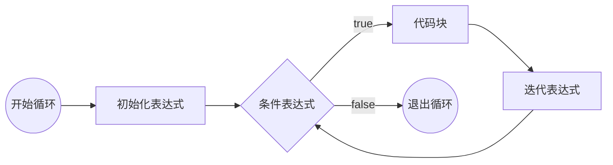
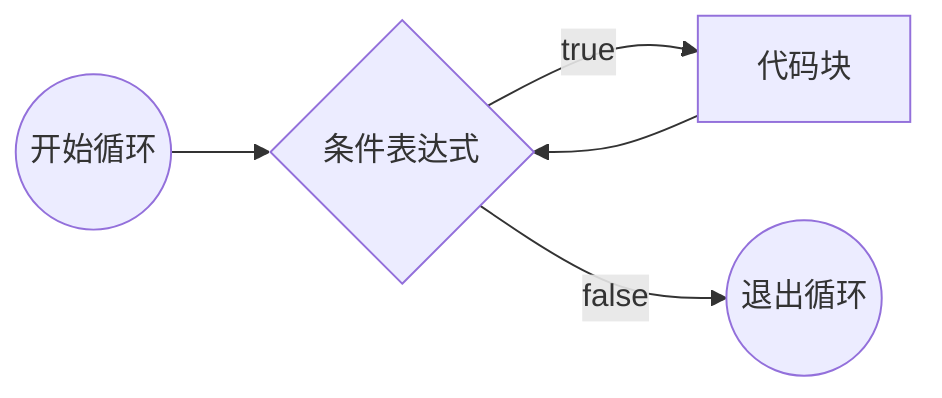
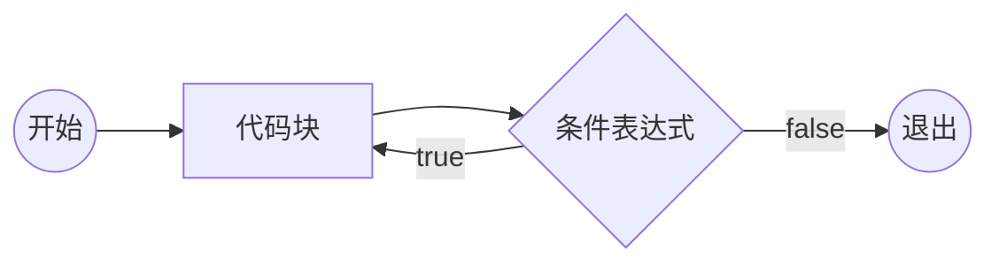

# JavaScript

## 起源

网景公司（_Netscape Communication Corporation_）于 1994 年推出了第一款商用浏览器：网景（_Netscape Navigator_）。
1995 年，网景公司决定在浏览器中加入一门编程语言，用于实现用户交互效果，提高用户体验。
网景公司聘请 **Brendan Eich** 开发这门语言。10 天后， LiveScript 语言诞生。后来为了商业考虑，更名为 JavaScript（_JS_）。

> Java 与 JavaScript 的关系：周杰 ~ 周杰伦；葡萄 ~ 葡萄牙。

### 第一次浏览器大战

网景公司计划在浏览器中加入网络操作系统，触动了微软的利益；
1995 年微软发布 IE 浏览器，第一次浏览器大战开启。
JS 推出之后，网景取得了极大的竞争优质。
微软对 JS 进行反编译，并借鉴 JS 推出了 JScript、VBScript 两种语言，这两种语言都可以在 IE 中执行。

第一次浏览器大战是**标准之争**。

1997 年，网景将 JavaScript 1.1 版本提交给 ECMA (_欧洲计算机制造协会_)，希望将其标准化。
ECMA 收录了 JavaScript 并提交给 ISO；经修改成为第一个JavaScript 标准，称为 **ECMAScript**，简称 ES。

IE3 发布，并绑定 Windows 操作系统，网景市场份额不断下滑，于 1998 破产被收购。

### 第二次浏览器大战

微软推出 IE4、IE5、IE6（捆绑 Windows XP）后，微软决定解散浏览器团队。
Brendan Eich 在网景解散后，带领团队成立 Mozilla 基金会，并将网景浏览器和 JS 开源。
长时间内世界技术爱好者们对网景浏览器进行维护和修补。
2002 年 Mozilla 基金会推出 Firefox 浏览器。
2008 年 Google 推出 Chrome 浏览器；2010 年 Apple 推出 Safari 浏览器；2012 年 ASA 推出 Opera 浏览器。
Chrome 浏览器搭载了 JS 引擎 V8，可以将 JS 代码直接转换为字节码；JS 代码的执行速度大幅提升，理论上已经接近汇编语言。从此 JS 具备了编写大型应用的能力，甚至服务器应用。**V8 引擎将 JS 的执行推向了一个新的台阶**。

> Ryan Dahl 直接利用 V8 引擎完成了 node.js，使 JS 语言在服务器端可以运行。

### ES 标准的发展

1997年 -- ES1
1998年 -- ES2
1999年 -- ES3
2009年 -- ES5，从此习惯上不再区分 JavaScrip 和 ECMAScript
2015年 -- ES6 / ES2015，从 ES6 开始，使用年号作为版本号
2016年 -- ES2016
……

==ES 的语言标准不涉及语言的运行环境==；正是因为 ES 避免了运行环境，让 ES 有机会在各种环境中运行，使 ES 成为了一个通用编程语言。

通常把 ES 运行的环境称为**宿主环境**

## 语言特性

1. JavaScript 是一种解释型语言
2. JavaScript 是一个弱类型语言
3. 单线程：上一件事情没有做完，下一件事情必须等待（_同步现象_）
4. 异步：提高单线程的执行效率

::: details 📚 编程语言分类

编译型语言：编译型语言会经过一个翻译的过程，负责编译的叫做编译器；翻译的结果叫做编译结果。

> 如 C、C++ 等
> 优点：执行速度快
> 缺点：某个编译结果难以适用于各种环境（_跨平台障碍_）、部署繁琐

解释型语言：没有编译结果。

> 如 JavaScript、Php 等
> 优点：跨平台、部署简单
> 缺点：执行速度稍慢

强类型语言：存放的数据类型不可变。

> 优点：严谨
> 缺点：灵活性差、不易上手

弱类型语言：存放的数据类型可变。

> 优点：灵活、易上手
> 缺点：不严谨

通常将弱类型的解释型语言称为脚本语言。

:::

### 浏览器环境中 JavaScript 代码的书写位置

1. 直接书写在页面中的 `<script>` 元素中
2. 写到外部 js 文件中，通过 `<script>` 元素的 `src` 属性引入
   - 有利于浏览器缓存
   - 有利于代码分离（_内容，样式，功能三者分离_），便于维护和阅读

::: tip

- 页面中可以存在多个 `<script>` 元素，执行顺序从上到下。
- 如果一个 `<script>` 元素使用 `src` 引入了外部代码，其内部书写的代码无效。
- `<script>` 元素的 `type` 属性可以指定代码语言；值为 MIME 类型。

:::

### 基本语法规则

- JavaScript 语法部分必须是英文符号
- JavaScript 代码由多条语句构成，语句以 `;` 结尾（_不具有强制性_）
- JavaScript 代码从上到下同步执行
- JavaScript 语言大小写敏感

### 输入输出语句

> 所有的输出输出语句都不是 ES 标准。

输出语句：

- `document.write()` 将数据输出到页面
- `alert()` 将数据以弹窗形式显示到页面
- `console.log()` 将数据输出到控制台

输入语句：

- `prompt("请输入：")` 弹出输入框，获取用户输入的数据
  - 点击取消返回 `null`
  - 点击确定返回用户输入的字符串

### 代码注释

```js
// 单行注释

/*
多行注释
*/
```

## 数据和数据类型

数据：有用的信息
数据类型：数据的分类

> 直接书写的具体数据，称为**字面量**。

### JS 中的数据类型

1. 原始类型(不可再细分的类型)
   - `number` 数字类型
   - `string` 字符串类型
   - `boolean` 布尔类型
   - `undefined` 未定义类型
   - `null` 空类型
2. 引用类型
   - `object` 对象
   - `function` 函数

#### 数字类型

表示小数、整数等
书写方式：直接书写

> 数字类型可以加上前缀，表示不同的进制；不加默认为十进制。
> 前缀 `0` 表示八进制；前缀 `0x` 表示十六进制；前缀 `0b` 表示二进制。

#### 字符串类型

表示一长串文本（_0 个或多个文本_）

书写方式：

1. 单引号包裹 `'some text'`
2. 双引号包裹 `"some text"`
3. 反引号包裹（_**模板字符串**_）`` `some text` ``

::: tip 在字符串中表示特殊字符

使用转义符 `\` 进行转义

- `\n` 换行符
- `\t` 制表符

:::

::: tip 使用长数字还是字符串？

如果按照数字阅读则使用数字类型，否则使用字符串类型。

:::

#### 布尔类型

表示真或假

书写方式：

- `true` 真
- `false` 假

#### `undefined` 类型

表示未定义

书写方式：`undefined`

#### `null` 类型

表示空值

书写方式：`null`

#### 对象

表示事物、东西等；对象可以由多个基本类型或对象组合而成

属性：对象的成员

::: details 📍 对象示例

```json
{
  name: "小明",
  age: 18,
  isStudent: true,
  address: {
    country: "china",
    province: "jiangsu",
    city: "suzhou"
  }，
  girlFriend: null
}
```

:::

### 判断数据的类型

#### `typeof` 操作符

返回数据类型的**字符串**

```js
typeof 123 // 'number'
typeof 'abc' // 'string'
typeof true // 'boolean'
typeof undefined // 'undefined'
typeof null // 'object' // JS 特性
typeof {} // 'object'
```

> 函数写法： `typeof()`

## 变量 _variable_

变量是一块用于存放数据的**内存空间**。

### 变量的使用

- 任何可以书写数据的地方都可以使用变量
- 无法使用一个未声明的变量
  - 使用 `typeof` 时除外

#### 声明（_定义_）变量

```js
var a // 声明了一个变量 a，声明后变量的值默认为 undefined
console.log(a) // undefined
```

::: info 标识符的命名

在开发中，需要自行命名的位置，叫做标识符。

标识符的命名规则：

1. 必须以字母、下划线或 `$` 符号开头
2. 其他位置可以出现数字、字母、下划线或 `$` 符号
3. 不可以与关键字、保留字重复

标识符命名命名规范：

1. 变量名应做到望文知义
2. 多个单词使用驼峰命名法

:::

#### 变量的赋值

赋值：向变量的内存空间中存放数据

```js
// 将 123 存放到变量 a 中
a = 123
```

- 变量可以被重新赋值，新的值会取代旧的值
  - JS 中变量的数据类型是可变的
- 声明和赋值可以合并（_语法糖_）
- 多个变量可以合并声明并赋值（_语法糖_）

::: details 📍 语法糖示例

```js
var a = 1
var b = a // 将变量 a 的数据**复制**到变量 b 中
b = 2 // 不影响变量 a 的数据（原始类型）
```

```js
var a = 1,
  b = 2,
  c = 3
```

> 语法糖只是方便书写或记忆，没有实质性改变。

:::

### 变量中的对象

```js
var user = {
  account: 'abc',
  password: '123456',
  isVip: true
}
```

读取对象变量的某个属性：`变量名.属性名`

::: important

- 当读取的属性不存在时，返回 `undefined`
- 当读取的属性值不存在时（_属性值为 `undefined` / `null`_），会报错

:::

修改对象变量的属性：

```js
var user = {
  account: 'abc',
  password: '123456',
  isVip: true
}
// 修改 user 对象的 password 属性值
user.password = '654321'
```

当赋值的属性不存在时会自动添加该属性

::: warning

```js
var user // user 为 undefined
user.name = 'shaw' // 会报错：原始类型 undefined 不可以添加属性
```

:::

删除属性：`delete 变量名.属性名`

> 实际编程时一般将属性值设为 `undefined` 以达到类似效果

#### 属性表达式

给属性赋值或读取属性时可以使用 `变量名["属性名"]`

属性表达式的使用场景：

- 属性名中包含特殊字符（_不是标准标识符_）
  - 实际上 JS 对属性名的命名并不严格，属性名可以为任意格式（_字符串_）
- 属性名为变量

```js
var prop = 'name'
user[prop] = 'shaw' // 即 user.name = 'shaw'
```

::: important

属性名只能为**字符串**
如果不是字符串，如数字，宿主环境会自动将其转换为字符串

```js
var obj = {
  0: 0
}
obj[0] = '零'
obj['0'] = 'zero'
console.log(obj[0]) // 'zero'
```

:::

### 变量的声明提升

**JS 中存在变量声明提升**：**所有**变量的**声明**会自动提升到代码最顶部

JS 中允许声明多个同名变量，声明提升后**声明会变为一个**

### 全局对象

JS 大部分宿主环境，都会提供一个特殊的对象，该对象可以在 JS 代码中直接访问，称为**全局对象**

- 浏览器全局对象：`window` (_表示整个窗口_)
- Node.js 全局对象：`global` (_表示当前 Node.js 进程_)

==开发者定义的所有变量实际上会成为全局对象的属性；但如果变量没有被赋值，则该变量不会覆盖全局对象中的同名属性==

::: tip

- 全局对象中的所有属性可以直接使用，前面无需加上全局对象名
- 变量赋值时不写 `var` 关键字，相当于直接给 `window` 的某个属性赋值

```js
var console = 'abc'
console.log('hello world') // 报错：console 被覆盖为字符串
```

```js
var console
console.log('hello world') // 正常输出
console = 'abc' // 无法访问声明的 console 变量，实际访问的是全局对象中的 console 属性
```

:::

::: details 📚 `window` 中特殊的 `name` 属性

```js
var name
console.log(name) // ''
console.log(typeof name) // string
// 因为 window 对象中含有属性 name
```

```js
var name = undefined
console.log(name) // 'undefined'
console.log(typeof name) // string
// name 属性会将任何赋值特殊处理为字符串
```

> 类似还有 `status` 等属性

:::

### 引用类型变量的存储机制

- 原始类型的变量存放具体的内容到内存中

  ```js
  var a = '123'
  var b = a
  b = '456'
  console.log(a) // '123'
  console.log(b) // '456'
  ```

- 引用类型的变量会另外开辟一块新的内存空间，存放对象的内容，再将该**内存空间的地址**存放到变量中

  ```js
  var obj1 = { name: '123' }
  var obj2 = obj1
  obj2.name = '456'
  console.log(obj1.name) // '456'
  console.log(obj2.name) // '456'
  ```

  `obj1` 指向某对象（_`obj1` 持有某对象的引用_）；`obj2` 指向同一对象（_`obj2` 也持有同一对象的引用_）

==出现对象字面量的位置，都一定会在内存中开辟一个新的空间==

::: details 📍 对象的存储机制示例

```js
var user1 = {
  name: '小明',
  age: 18,
  address: {
    // 新的空间
    country: 'china'
  }
}
var user2 = {
  name: '小红',
  age: 18,
  address: user1.address
}
user2.name = '小刚'
user2.address.country = 'uk'
console.log(user1.name, user2.name) // '小明' '小刚'
console.log(user1.address.country, user2.address.country) // 'uk' 'uk'
```

:::

> 出现一对 `{}` 即为一块新的内存空间

<!-- @include: @demo/JS-1-VariableSwitch.md#demo -->

#### JS 中的垃圾回收

JS 引擎中的垃圾回收器会定期的发现内存中无法访问到的对象，该对象称之为垃圾；
JS 引擎会在合适的时间将垃圾占用的内存空间释放。

## 运算符

运算符解决数据的运算问题

### 操作符和操作数

操作符：_运算符_，参与运算的符号
操作数：参与运算的数据，也称之为**元** / **目**

::: tip

- 操作符不一定只有一个符号
- 操作符出现在不同的位置可能具有不同的含义

:::

::: details 📍 操作符示例

1. `=` 赋值符，将右边的数据赋值给左边
2. `.` 访问符，用于访问对象的属性
3. `[]` 访问符，同上
4. `()` 函数调用符

:::

### 运算符的分类

按操作数数量分类：

- 一元（_单目_）运算符
  - `()`, `.`, `[]`...
- 二元（_双目_）运算符
  - `+`, `-`, `*`, `/`, `%`, `=`...
- 三元（_三目_）运算符
  - `?`, `:`

按功能分类：

- 算术（_数学_）运算符
- 比较运算符
- 逻辑运算符
- 位运算符
- 其他...

### 表达式

表达式 = 操作符 + 操作数

每个表达式都有一个运算结果，该结果称为**返回值**；返回值的类型称为**返回类型**

==所有的表达式都可以当作数据使用==

::: tip 字面量与表达式

- 字面量：直接书写的固定数据
- 表达式：产生值的过程
- 字面量是表达式的一个子集

:::

#### 常见表达式的返回值

1. `=` 赋值符：返回赋的值
   - `a = b = c = 1` 利用返回值赋值多个变量
   - 如果为声明 + 赋值的表达式，返回值为 `undefined`
2. `.` 访问符：返回属性的值
3. `()` 函数调用符：返回的结果取决于函数的运行结果
   - `console.log()` 的返回值为 `undefined`

   > ```js
   > console.log(console.log('')) // undefined
   > ```

::: info `REPL` 环境

浏览器控制台的环境为 `REPL` 环境：
REPL(Read-Eval-Print-Loop)：读取-执行-打印-循环
直接在控制台书写代码时，除了会执行代码，还会输出该表达式的返回值

:::

#### 在模板字符串中使用表达式

```js
var user = {
  name: 'Mike',
  age: 18,
  gender: 1
}
var example = `${user.name} is ${user.age} years old, gender is ${user.gender == 1 ? 'Male' : 'Female'}.`
```

### 算数运算符

- `+` 加 / 正
- `-` 减 / 负
- `*` 乘
- `/` 除
- `%` 求余数（与取模有细微区别）
- `++` 自增
- `--` 自减
- `**` 幂运算

#### 运算中的特殊数字

- 当除数为 `0` 时，得到关键字 `Infinity` (`number` 类型)
  - 被除数为正数：`Infinity` 正无穷
  - 被除数为负数：`-Infinity` 负无穷
  - 被除数为 `0`：`NaN` (_Not a Number_, 非数字，`number` 类型)
- `NaN` 虽然虽然是数字，但其和任何数字进行算术运算的结果都是 `NaN`

::: details 📚 `isNaN` 函数：返回一个数据是否为 `NaN`

```js
isNaN(NaN) // true
isNaN(123) // false
```

:::

::: details 📚 `isFinite` 函数：返回一个数据是否为有限数字

```js
isFinite(Infinity) // false
isFinite(-Infinity) // false
isFinite(NaN) // false
isFinite(123) // true
```

:::

#### `%` 求余运算符

```js
console.log(5 % 2) // 1
console.log(-5 % 2) // -1
console.log(10 % -3) // 1
console.log(-10 % -3) // -1
```

::: details 📚 求余和取模

- 求余（_x rem y_）：x - n \* y
  - n = x / y （_向零取整：直接去掉小数_）
  - 余数与**被除数符号相同**；与除数的符号无关
- 取模（_x mod y_）：x - n \* y
  - n = x / y （_向下取整_）
  - 余数与**除数的符号相同**；与被除数符号无关

:::

#### 非数字类型使用算术运算符

算数运算符（除 `+` 外）遇到非数字的类型时，会将其转换为数字类型（自动完成转换），然后进行运算；

> 运算中的类型转换不会影响原数据

::: important （非 `+` 运算符）转换规则

> `valueOf()`

1. `true` ==> `1`; `false` ==> `0`
2. `null` ==> `0`
3. `undefined` ==> `NaN`
4. `string` 类型：
   - 如果字符串内部是一个正确的数字（含 `Infinity`），则直接转换为数字
   - 如果字符串内部不是一个正确的数字，则转换为 `NaN`
   - 如果是一个空字符串 `""`，转换为 `0`
   - 字符串转换时会忽略首尾空格
5. `object` 类型：将对象类型先转换为字符串 `"[object Object]"`, 然后再将该字符串转换为数字类型，即 `NaN`

   ```js
   {} * 5 // 报错：{} 被解释为代码块
   ({} * 5) // ==> NaN * 5 // NaN
   ```

:::

::: tip 一元 `+`

通常在非数字的类型前面加 `+` 运算符，可以强制转换为数字类型

- `+true` ==> `1`
- `+{}` ==> `NaN`

> JS 中 `0` 分为 `+0` 和 `-0` 两种形式。

:::

::: important 多元 `+` 运算符的运算规则

> `valueOf()` 再 `toString()`

1. 加号某一边出现 `string` / `object` 类型：进行字符串拼接(将其他类型转为字符串)
   - 数字 ==> 数字字符串
   - `null` ==> `"null"`
   - `undefined` ==> `"undefined"`
   - `boolean` ==> `"true"` / `"false"`
   - 普通 `object` ==> `"[object Object]"`
2. 加号两边都为其他原始类型：[转为数字运算](#非数字类型使用算术运算符)

:::

#### 自增与自减

- `++` 将某个变量的值自增 `1`
- `--` 将某个变量的值自减 `1`

自增与自减表达式：

- `x++` 将变量 `x` 自增 `1`; 返回自增之前 `x` 的值（_先返回后自增_）
- `++x` 将变量 `x` 自增 `1`; 返回自增之后 `x` 的值（_先自增后返回_）
- `x--` 将变量 `x` 自减 `1`; 返回自减之前 `x` 的值
- `--x` 将变量 `x` 自减 `1`; 返回自减之后 `x` 的值

```js
var a = 1
console.log(a++) // 1
```

#### 算数运算符优先级

`++`，`--` >> `+` 正，`-` 负 >> `**` >> `*`，`/`，`%` >> `+` 加，`-` 减 >> `=` 赋值

::: important 运算符优先级的运行细节

- 从左到右依次查看，每次运算后再从左开始查看
- 如果遇到操作数，则将数据的值直接取出
- 如果遇到相邻的两个运算符，左边的运算符优先级大于等于右边，则运行左边的运算

:::

<!-- @include: @demo/JS-5-OperatorPriority.md#demo -->

### 比较运算符

- 比较运算符的返回值为 `true` / `false`
- 算术运算符的优先级高于比较运算符

#### 大小比较

- `>` 大于
- `<` 小于
- `>=` 大于等于
- `<=` 小于等于

比较规则：

1. 其中一边为**非字符串**的原始类型：[转换为数字比较](#非数字类型使用算术运算符)
2. 两边都为字符串：比较对位字符的 ASCII 编码(_从前往后，没有对位按 0 计算_)

   ```js
   console.log('A' > 'B') // 65 > 66 ==> false
   console.log(`AB` > `AC`) // 65 = 65; 66 > 67 ==> false
   console.log('11' > '1') // 49= 49; 49 > 0 ==> true
   ```

3. 其中一边为对象：将对象转换为原始类型（_`"[object Object]"` ==> `NaN`_）再按以上两种规则比较

::: tip 特殊数字比较规则

- `NaN` 与其他任何数字比较，结果为 `false`
- `Infinity` 大于任何其他数字
- `- Infinity` 小于任何其他数字

:::

#### 相等比较

- `==` 比较两个数据是否相等
- `!=` 比较两个数据是否不相等

两边的类型相同：直接比较数据本身（_两个对象比较对象地址_）

两边类型不同：

1. `null` 与 `undefined` 互相相等；但与其他类型不等
2. 其他原始类型[转换为数字比较](#非数字类型使用算术运算符)
3. 其中一边为对象比较时，转换为原始类型再比较

::: important 特殊数字相等规则

- `NaN` 与任何数字（_包括自身_）都不相等
- `Infinity` / `-Infinity` 只与自身相等

:::

> 由于 `==` 规则比较违反直觉，通常不使用 `==` 进行相等比较

#### 严格相等

- `===` 严格相等，两端类型和数据必须都相同
- `!==` 严格不相等，两端类型或数据任一不相同

两端类型不相同：直接返回 `false`
类型相同：比较数据本身（_对象比较地址_）

::: important 特殊数字严格相等规则

- `NaN` 与任何数字（_包括自身_）都不相等
- `Infinity` / `-Infinity` 只与自身相等

:::

### 逻辑运算符

==逻辑运算符的返回值不一定为 `Boolean` 类型==

#### 与 / 并且 `&&`

<表达式 1> `&&` <表达式 2>

执行过程：
将<表达式 1>进行 Boolean 判定；
若<表达式 1>判定结果为假，则直接返回<表达式 1>的结果，**而不执行<表达式 2>**；
若<表达式 1>为真，则返回<表达式 2>的结果（_短路规则_）

::: important Boolean 判定

以下数据均判断为 `false` (_其他数据均为 `true`_)：

- `false`
- `null`
- `undefined`
- `NaN`
- `''`
- `0`

:::

#### 或 `||`

<表达式 1> `||` <表达式 2>

执行过程：将<表达式 1>进行 Boolean 判定；
若<表达式 1>判定结果为真，则直接返回<表达式 1>的结果，**而不执行<表达式 2>**；
若<表达式 1>为假则返回<表达式 2>的结果（_短路规则_）

#### 非 `!`

`!` <表达式>：将表达式的 Boolean 判定结果取反（_一定返回 `Boolean` 类型_）

```js
console.log(!true) // false
console.log(!2 + 1) // 1
```

<!-- @include: @demo/JS-6-LogicalOperator.md#demo -->

<!-- @include: @demo/JS-4-JudgeLeapYear.md#demo -->

### 三目运算符

<表达式 1> `?` <表达式 2> `:` <表达式 3>

执行过程：对<表达式 1>进行 Boolean 判定，若为真，则返回<表达式 2>的结果；若为假，则返回<表达式 3>的结果

```js
var x = 1
x = x++ >= 1 ? x++ * x++ : ++x * ++x // x++ * ++x
// 2 * 3
// 6
```

### 复合赋值运算符

- `+=` 加等于
- `-=` 减等于
- `*=` 乘等于
- `/=` 除等于
- `%=` 求余等于
- `**=` 幂等于

```js
x += 1 // x = x + 1
x *= 1 + 2 // x = x * (1 + 2)
```

### `void` 运算符

一元运算符；运行表达式，并返回 `undefined`

- 普通写法 `void` <操作数>
- 函数写法 `void(` <表达式> `)`

### 逗号运算符

<表达式 1> `,` <表达式 2>

依次运行表达式，然后返回<表达式 2>的结果

```js
var x = 1
x = (x++ * 2, x++ * 2, x++ * 2) // x = 6
```

> 逗号运算符的优先级低于赋值运算符

### JS 如何存储数字

- JS 中小数和整数的运算都是不精确的
- JS 中整数不是连续的
  - 当数字特别大时不再连续
- JS 中十进制的小数，转换为二进制后，可能是无限小数；由于存储能力限制，因此会丢失一些精度

==在对精度要求很高的系统中，或要对小数运算结果进行比较时，需要特别注意==

::: details 📚 计算机语言存储数字的方式

1. 整数法
2. 浮点法
   - 浮点法存放的数字叫 _浮点数_
   - 浮点数分为单精度和双精度
   - 双精度存放的有效位数更多，占用空间更大

计算机中，位（_bit_）是计算机最小的存储单位，一个位可以存储 `0` 或 `1` 两种状态

- 1 byte = 8 bit
- 1 KB = 1024 byte

:::

JS 中存储的所有数字，都按照双精度浮点数存放(IEEE 754 标准)：

- 每个数字开辟一个内存空间，尺寸固定为64位
  - 第 `1` 位：表示符号位，`0` 表示正数，`1` 表示负数
  - 第 `2 ~ 12` 位（_11位_）：表示指数位，即 2 为底的指数（_2 的次方_），其范围为 `0 ~ 2047`
  - 第 `13 ~ 64` 位（_52位_）：表示尾数，相当于`1.xxxx` 的小数位
- 表示的十进制数的方法 `1.尾数 * 2 ^ (指数位 - 1023)`

特殊情况：

1. 指数为 `0`，尾数为 `0`：表示 `0`
2. 指数为 `2047`，尾数为 `0`：表示 `Infinity` / `-Infinity`
3. 指数为 `2047`，尾数非 `0`：表示 `NaN`

> 一个正常的数字的指数部分最大为 2046

- JS 能表示的最大数字： `Number.MAX_VALUE` 即 `0 11111111110 111....111`
- JS 能表示的最小正数： `Number.MIN_VALUE` 即 `0 00000000000 000....001`
- JS 能表示的最大安全数（_最大连续整数_）：`Number.MAX_SAFE_INTEGER` 即 `0 10000110011 111...111` 即 `2^53 - 1`

### 位运算

将一个整数的二进制格式进行计算；在 JS 中，如果对一个数据进行位运算，先会将其转换为一个整数（_直接抹去小数部分_），然后按照 **32 位**的二进制格式进行运算

::: info 32 位二进制格式

- 第一位为符号位，其余为数据位
- 特殊数字的32 位二进制：全为 `0`

:::

#### 与运算 `&`

<整数 1> `&` <整数 2>

将两个整数按位比较，如果都为 `1`，则结果为 `1`，否则为 `0`

#### 或运算 `|`

<整数 1> `|` <整数 2>

将两个整数按位比较，如果有一个为 `1`，则结果为 `1`，否则为 `0`

#### 否运算 `~`

`~` <整数>

将该整数按位取反

> 快速算法：该整数的相反数减一

::: details 📍 JS 中最快速的取整

```js
~~3.5 // 3
```

:::

#### 异或运算 `^`

<整数 1> `^` <整数 2>

将两个整数按位比较，相同为 `0`，否则为 `1`

::: details 📍 位的叠加 / 位的开关

```js
// 权限枚举
var perm = {
  read: 0b001,
  write: 0b010,
  create: 0b100
}

// 保存权限
var p = perm.read | perm.write

// 判断权限
p & (perm.read === perm.read) ? console.log('有读权限') : console.log('无读权限')

// 去掉权限
p = (p | perm.read) ^ perm.read
```

:::

#### 左移运算 `<<`

<整数> `<<` <位数>

将整数的二进制数据位向左移动指定位数（_即 `整数 * 2 ^ n`_）

#### 右移运算 `>>`

<整数> `>>` <位数>

将整数的二进制数据位向右移动指定位数（_即 `整数 / 2 ^ n` 并取整_）

> `>>>` 全右移运算：包含符号位向右位移

## 流程控制

### 判断

#### `if` 语句

```js
// 单个 if 结构
if (条件表达式) {
  // 代码块
} else if (条件表达式) {
  // 代码块
} else if (条件表达式) {
  // 可以没有 else if
  // 代码块
} else {
  // 可以没有 else
  // 代码块
}
```

对条件表达式进行[Boolean判定](#与--并且-)；若为真，则执行代码块；

- 如果代码块只有一条语句则可以省略 `{}`
- **如果某个条件判定为真则忽略后面所有条件**

::: details 📍 if 语句示例

```js
var score = 85
if (score >= 90) {
  console.log('优秀')
} else if (score >= 80) {
  console.log('良好')
} else if (score >= 60) {
  console.log('及格')
} else {
  console.log('不及格')
}
```

```js
if (!x) {
  x = 0
}
if (x++ >= 1) {
  var x // 声明提升
  x++
} else if (++x >= 2) {
  x++
} else {
  x--
}
console.log(x) // 3
```

:::

#### `switch` 语句（_开关_）

> `switch` 的语法始终可以使用 `if` 语句替代

```js
switch (表达式) {
  case 数据1:
  // 代码块
  case 数据2:
  // 代码块
  default: // 可选，都不匹配时执行
  // 代码块
}
```

计算表达式的返回值，依次和 `case` 后的数据进行**严格相等**比较；如果某个 `case` 相等，则停止比较并运行其内部的代码块，**然后依次运行之后所有 `case` 的代码块**。

在 `case` 分支内部使用 `break` 关键字，可以立刻停止 `switch` 结构：

```js
switch (表达式) {
  case 数据1:
    // 代码块
    break
  case 数据2:
    // 代码块
    break
  default:
    // 代码块
    break // 可以省略
}
```

### 循环

重复运行一段代码

> 条件永远满足则为死循环，无法退出

#### `for` 循环

```js
// 初始化表达式的声明提升
for (初始化表达式; 条件表达式; 迭代表达式) {
  // 代码块
}
```



#### `while` 循环

```js
while (条件表达式) {
  // 代码块
}
```



#### `do-while` 循环

```js
do {
  // 代码块
} while (条件表达式)
```

先运行一次循环体再进行条件判断



#### `for in` 循环

```js
for (var prop in 对象) {
  // 代码块
}
```

取出对象所有属性名，每次循环将其中一个**属性名**赋值给 `prop`，然后执行代码块

::: important `in` 关键字

```js
属性名 in 对象
```

判断对象是否有指定**属性名（_字符串_）**，返回 `true` / `false`

:::

#### 循环控制语句

1. `break` 跳出当前循环结构
2. `continue` 跳过本次循环，进入下一次循环

> 多层循环分开分析

## 数组

用于存放多个数据

### 创建数组

1. `new Array(长度)` 创建指定长度的空数组
   - 长度：数组的数据总数，非负整数
2. `new Array(元素1, 元素2, ...)` 创建数组并初始化元素
3. `[元素1, 元素2, ...]` 创建数组并初始化每一项的值

### 数组的本质

数组的本质是一个**对象**

- 数字字符串属性名：数组的索引（_下标_），从 `0` 开始
- `length` 属性：数组的长度；自动更新，值为**最大下标加一**

::: details 📍 数组示例

```js
var arr = [1, 2, 3]
arr[0] = 10
arr['0'] = 5
console.log(arr[0], arr['0']) // 5, 5

arr.abc = 'abc'
arr.[10] = 10

var arr2 = [ , , ,4] // 属性不存在
var arr3 = [undefined, undefined, undefined, 4] // 属性存在
var arr4 = [ , , , , ] // 长度为 3
var arr5 = new Array(10) // 稀疏数组
```

:::

::: important

通常情况下下标是连续；连续下标的取值范围为 `0` ~ `length - 1`；**下标不连续的数组叫做稀疏数组**

如果给 `length` 属性赋值，会自动调整数组的长度；如果赋值小于当前长度，会截断数组，非数字属性会保留

:::

### 数组的常用操作

#### 添加 / 删除元素

```js
// 向指定下标添加元素
arr[0] = 1

// 向末尾添加元素
arr[arr.length] = 2
arr.push(3)
arr.push(4, 5)

// 向开头添加元素；会导致数组下标向后移动
arr.unshift(0)
arr.unshift(-1, -2)
```

```js
// 删除属性；不会导致数组其他属性变化，会产生稀松数组
delete arr[1]

// 删除最后一项
arr.pop() // 返回被删除的元素

// 删除第一项
arr.shift() // 返回被删除的元素
```

#### splice 操作

```js
arr.splice(起始下标, 删除个数, 插入元素1, 插入元素2, ...)
```

从指定下标位置删除多个元素，然后插入数据：

- **返回一个新数组，包含被删除的元素；未删除任何元素则返回 `undefined`**
- 如果下标超过下标范围，则按左右边界处理
- 删除个数超过数组长度，则全部删除

#### slice 数组切片

```js
arr.slice(起始下标, 结束下标)
```

取出起始下标到结束下标（不包含）的元素，并**返回一个新数组**；不会改变原数组

- 下标为负数，则从末尾开始计算
- 不指定结束下标，则默认取到数组末尾

#### 数组查找

```js
arr.indexOf(元素)
```

返回数组中指定元素的第一个下标（严格相等）；如果不存在，则返回 `-1`

```js
arr.lastIndexOf(元素)
```

返回数组中指定元素的最后一个下标（严格相等）；如果不存在，则返回 `-1`

> 无法使用 `indexOf` / `lastIndexOf` 查找对象，因为是严格相等

#### fill 数组填充

```js
arr.fill(元素)
arr.fill(元素, 起始下标, 结束下标)
```

将数组的指定下标返回填充（_替换_）为指定元素：

- 不指定下标，则视为全部填充
- 不指定结束下标，则默认到数组末尾

#### 清空数组

1. `arr.length = 0`
2. `arr.splice(0, arr.length)`

#### 字符串拼接

将数字每一项转换为字符串，然后用指定字符拼接：

```js
var str = arr.join('分隔符')
```

#### 数组拼接

向数组末尾拼接另一个数组：

```js
var arr3 = arr1.concat(arr2) // 返回一个新数组；不会改变原数组
```

### 数组的遍历

遍历：输出数组每一项

#### `for in` 遍历

```js
for (var i in arr) {
  console.log(arr[i])
}
```

::: important
与普通 `for` 循环区别于遍历稀松数组时不会遍历到空项
:::

### 数组的克隆

克隆：产生一个全新的对象，包含相同的属性和值

```js
var arr2 = arr1.slice() // 或 var arr2 = arr1.slice(0)
```

### 二维数组

数组的每一项都是一个数组

::: details 📍 输出二位数组所有项

```js
var arr = [
  [1, 2, 3],
  [4, 5, 6],
  [7, 8, 9]
]
for (var i = 0; i < arr.length; i++) {
  for (var j = 0; j < arr[i].length; j++) {
    console.log(arr[i][j])
  }
}
```

:::

### 数组的应用

```js
var arr1 = [1, 2, 3]
var arr2 = arr1 // 数组的本质是对象，对象存放的是地址
arr2[0] = 10
console.log(arr1) // [10, 2, 3]
console.log(arr2) // [10, 2, 3]
```

<!-- @include: @demo/JS-7-FibonacciArray.md#demo -->
<!-- @include: @demo/JS-8-TwoDimensionalArray.md#demo -->
<!-- @include: @demo/JS-9-SortArray.md#demo -->
<!-- @include: @demo/JS-10-ArrayCount.md#demo -->

## 函数

重复代码会导致程序难以维护（_修改_）；函数主要用于减少重复代码

定义 / 声明 / 创建函数：

```js
function 函数名(参数1, 参数2, ...) {
  // 函数体
  return 返回值
}
```

函数体的代码不会直接运行，必须手动调用函数才能执行其中代码；调用函数：

```js
函数名(参数1, 参数2, ...)
```

### 函数的声明提升

- 通过函数字面量声明的函数（如上）会自动提升到脚本块的顶部
- 函数字面量会成为全局对象的属性

#### 函数内部的变量声明

- 不使用 `var`: 给全局对象添加属性
- 使用 `var` 声明：变量声明提升到函数体顶部

```js
function test() {
  var a = 3
  a--
}
var a = 5
test()
console.log(a) // 5
```

### 函数的参数

参数：函数运行的未知条件，由调用者告知

> 函数声明时定义的参数是形参，调用时传入的参数是实参

- 参数只在函数体内有效
- 如果调用时未传递某个实参，则对应的形参为 `undefined`
- 传入引用类型的参数时，传入的是地址

### 函数的返回值

函数运行后得到的结果

调用函数时，调用表达式的值就是函数的返回值

#### `return` 关键字

- `return` 会直接结束函数的执行；下方代码不会执行
- `return` 后不写表达式，则返回 `undefined`
- 如果函数没有 `return`, 则默认在函数体末尾自动返回 `undefined`

<!-- @include: @demo/JS-11-Is-Prime.md#demo -->

#### 文档注释

```js
/**
 * 函数说明
 * @param {参数类型} 参数名：参数说明
 * @returns {返回值类型} 返回值说明
 */
```

<!-- @include: @demo/JS-12-FunctionExample.md#demo -->

### 作用域

作用域：一块代码区域，一个运行环境
全局作用域：直接在脚本中书写的代码；函数作用域：函数内部的代码

- 在全局作用域中声明的变量会被提升到脚本块顶部，并成为全局对象的属性
- 在函数作用域中声明的变量，会被提升到函数顶部；不会成为全局对象的属性（_不会污染全局变量_）

> 尽量把功能封装在函数中

#### 作用域中的变量使用

- 全局作用域只能使用全局作用域中声明的变量 / 函数
- 函数作用域可以使用作用域内部的变量，也可以使用 _外部环境_ 中声明的变量 / 函数
  - 函数内部声明的变量和外部环境冲突时，使用作用域内部的变量
  - 使用一个内部作用域没有的变量 / 函数时会逐级向上层作用域寻找
- 函数调用完成后内部环境中的变量会被销毁

```js
var a = 'a'

function test() {
  var b = 'b'
  console.log(a) // a
  console.log(b) // b
  console.log(c) // Error: c is not defined

  function inner() {
    var c = 'c'
    console.log(a) // a
    console.log(b) // b
    console.log(c) // c
  }

  inner()
}
test()
```

::: tip

当某个函数功能比较复杂，在编写该函数时，可能需要另一些函数辅助完成其功能，而这些辅助函数仅会被该函数使用，则可以将这些辅助函数定义在函数内部

:::

#### 闭包 _closure_

闭包：一种现象，内部函数可以使用外部函数环境中的变量 / 函数

### 函数表达式

JS 中，函数也是一个数据；函数可以用于任何需要数据的地方；

- `(function example() {})` 返回函数本身
- 当函数作为一个表达式时，既不会声明提升也不会成为全局对象的属性
- 函数表达式无法通过函数名调用

由于大部分情况下，函数表达式的函数名无意义，一般可以省略；没有函数名的函数称为**匿名函数**

```js
// 函数表达式
// 创建一个函数，将其赋值给变量
// 变量声明提升
var a = function () {}
// 调用该函数
a()

// 函数字面量
// 函数声明提升
function b() {}
```

- ==函数是一个引用类型==，赋值时保存的是地址
- `typeof 函数名` 返回值为 `"function"`

#### 立即执行函数 _IIFE_

> IIFE: Immediately Invoked Function Expression

书写一个函数表达式，然后将其立即调用

1. `(function example() {})()`
2. `(function example() {}())`

#### 回调函数

将函数作为参数传入，并在合适的时机调用

```js
function test(callback) {
  callback()
}

function call() {
  console.log('call')
}

test(call)
```

<!-- @include: @demo/JS-13-CallbackFunction.md#demo -->

### `this` 关键字

> `this` 无法被赋值

1. 全局作用域中：`this` 固定指向全局对象（_`window`_）
2. 在函数作用域中：`this` 指向取决于调用方式
   - 直接调用函数：`this` 指向全局对象
   - 作为对象的属性并调用（_`对象.属性()` / `对象[属性]()`_）：`this` 指向该对象

==`this` 的指向在函数执行时才能确定==

```js
var obj = {
  a: function () {
    console.log(this)
  },
  b: {
    c: function () {
      console.log(this)
    }
  }
}

obj.a() // obj
obj.b.c() // obj.b

var x = obj.b.c
x() // window
```

```js
var someone = {
  firstName: 'John',
  lastName: 'Doe',
  sayName: function () {
    console.log(this.firstName + ' ' + this.lastName)
  }
  // 不能直接使用 someone.firstName 和 someone.lastName：防止该对象被重置
}

someone.sayName() // John Doe
```

> 对象中的属性如果是一个函数，也称其为对象的方法

::: details 📍 使用单对象模式 / 命名空间模式减少全局变量污染

```js
var myFunctions = {
  a: function () {
    console.log('a')
  },
  b: function () {
    console.log('b')
  }
}
```

:::

### 构造函数

> 也称构造器

用函数创建对象可以减少繁琐的流程

1. 函数返回一个对象（_工厂函数_）：

   ```js
   function createPerson(name, age) {
     return {
       name,
       age,
       sayName() {
         console.log(this.name)
       }
     }
   }

   var person = createPerson('John', 25)
   ```

2. 构造函数：

   ```js
   new 函数(参数1, 参数2, ...)
   ```

使用 `new` 关键字调用函数创建对象，则该函数为构造函数

- 构造函数专用于创建对象
- 构造函数通常使用大驼峰命名

==构造函数内部会自动创建一个新对象，`this` 自动指向新建对象，并自动返回该对象==

```js
function Person(name, age) {}

var p1 = Person('John', 25) // undefined
var p2 = new Person('John', 25) // {}

function User(name, age) {
  this.name = name
  this.age = age
}

var u1 = User('John', 25) // { name: 'John', age: 25}
```

构造函数中如果出现返回值：

- 如果返回原始类型，则直接忽略
- 如果返回引用类型，则使用该返回值

所有的对象本质都是通过构造函数创建的：

```js
var arr = [1, 2, 3] // 语法糖 new Array(1, 2, 3)
var obj = { a: 1, b: 2 } // 语法糖 new Object({ a: 1, b: 2 })
function createPerson(name, age) {
  return {
    name,
    age,
    sayName() {
      console.log(this.name)
    }
  } // 语法糖，返回构造函数
}
```

#### `new.target`

`new.target`: 该表达式在函数中使用，返回当前构造函数

通常用于判断该函数是否使用 `new` 调用；如果该函数不是通过 `new` 调用，则返回 `undefined`

```js
function User(name, age) {
  if (new.target === undefined) {
    return new User(name, age)
  }
  this.name = name
  this.age = age
}
```

<!-- TODO: 英雄打怪游戏(构造函数) -->

### 函数的本质

函数的本质就是对象

```js
var sum = new Function('a', 'b', 'return a + b')
console.log(sum(1, 2)) // 3
console.log(typeof sum) // 'function'
```

所有的函数都是通过 `new Function()` 创建的

- `Function` 构造函数由浏览器提供
- `Function` --> 产生函数对象 --> 产生普通对象

由于函数本身是一个对象，所以函数可以拥有属性

```js
console.log(typeof Number) // 'function'
console.log(typeof Number.isNaN) // 'function'
console.log(Number.MAX_SAFE_INTEGER) // 2^53 - 1
```

#### 包装类

JS 为了增强原始类型的功能，为 `boolean`、`string`、`number` 专门创建了构造函数

如果语法上将原始类型当作对象使用时（_一般在使用属性时_），JS 会自动在该位置利用对应的构造函数，创建一个对象来访问该原始类型的该属性。

```js
var a = 3.1415
a.toFixed(2)(
  // '3.14'
  new Number(3.1415)
).toFixed(2) // '3.14'
```

```js
var x = 123
var y = new Number(123)
console.log(x == y) // true
console.log(x === y) // false // 类型不同
```

::: important

- 在 JS 中，可以认为构造函数就是类，创建的对象就是实例
- 成员方法（属性） / 实例方法（属性）：通过构造函数创建的对象上的方法（属性）
- 类方法（属性） / 静态方法（属性）：通过构造函数本身调用的方法（属性）

:::

### 递归

函数内部直接或间接调用自身

```js
// 求斐波那契数列第 n 项
function f(n) {
  if (n === 1 || n === 2) {
    return 1
  }
  return f(n - 1) + f(n - 2)
}
```

#### 执行栈 _call stack_

无论任何代码的执行，都必须有一个执行环境，执行环境为代码执行提供支持；执行环境全部放在执行栈中。

每个函数的调用都需要创建一个函数执行环境，函数调用结束，该执行环境就会被销毁

<!-- @include: @demo/JS-14-CallStack.md#demo -->

```js
// n 的阶乘

function f(n) {
  if (n === 1) {
    return 1
  }
  return n * f(n - 1)
}
```

**递归使用时要避免无限递归（_没有终止条件_）**

执行栈有相对固定的大小，如果执行环境太多，执行栈无法容纳，会报错：`Maximum call stack size exceeded`（_栈溢出_）

::: tip 对比无限循环

死循环不会报错，也不会导致栈溢出（_只有一个执行环境_）

:::

::: details 📚 尾调用

如果一个函数最后一条语句是调用函数，且最后一条语句表达式仅由调用函数组成，则称该语句为**尾调用**；如果尾调用是调用函数自身，则称为**尾递归**

某些语言或执行环境会对尾调用进行优化：会立即销毁当前函数的执行环境，避免执行栈空间被占用。

在浏览器环境中均未实现尾调用优化（_由于调试、性能分析、栈追踪等开发体验问题，暂无计划_）；但 node 环境中可以使用

:::

### `arguments` 关键字

`arguments` 关键字：表示函数调用时传入的所有参数（_实参_）组成的**类数组**（_伪数组_）

- 可以取到未定义但传入的多余参数
- `arguments` 的值会与对应的形参绑定，但未传的参数不会映射

> 伪数组：没有通过 `Array` 构造器创建的类似数组的结构，缺少很多数组的实例方法

## 标准库

标准库也称标准 API
标准：ECMA 标准

库：_library_，一组预先编写好的代码，可以直接使用，无需自己编写
API：_Application Programming Interface_，应用程序编程接口

### `Object` 构造函数

```js
new Object(value)
Object(value)
```

`Object()` 构造函数将输入转换为一个对象

- 如果该值是 `null` 或者 `undefined`，它会生成并返回一个空对象
- 如果该值已经是一个对象，则返回该值
- 否则，返回与给定值对应的类型的对象

  ```js
  var x = new Object(123) // new Number(123)
  ```

#### `Object` 的静态成员

属性：

- `Object.length` 固定为 `1`，表示参数个数

方法：

1. `Object.keys(obj)`
   - 参数 `obj` 是一个对象
   - 返回给定对象自身可枚举的属性名（_键_）组成的字符串数组

2. `Object.values(obj)`
   - 参数 `obj` 是一个对象
   - 返回给定对象自有可枚举键的值组成的数组

3. `Object.entries(obj)`
   - 参数 `obj` 是一个对象
   - 返回一个数组，数组的每一项是一个 `[key, value]` 数组，表示对象自身可枚举的键值对

```js
var obj = { a: 1, b: 2, c: 3 }
console.log(Object.keys(obj)) // ['a', 'b', 'c']
console.log(Object.values(obj)) // [1, 2, 3]
```

#### `Object` 的实例成员

只要是对象，都有 `Object` 的实例成员

1. `Object.prototype.toString()` 返回该对象的字符串

   ```js
   var obj = { a: 1, b: 2, c: 3 }
   console.log(obj.toString()) // [object Object]
   ```

   默认情况下，对象的 `toString()` 方法返回 `[object Object]`；**但实例成员可以被重写**，如数组的 `toString()` 方法

2. `Object.prototype.valueOf()` 返回对象的值；默认情况下，返回对象本身

   ```js
   var obj = { a: 1, b: 2, c: 3 }
   console.log(obj.valueOf()) // { a: 1, b: 2, c: 3 }
   console.log(obj.valueOf() === obj) // true
   ```

::: important

在 JS 中，当自动进行类型转换时，如果转换的是一个对象，实际上会先调用对象的 `valueOf()` 方法，然后调用返回结果的 `toString()` 方法，然后将得到的结果进行进一步转换。

```js
var obj = {
  a: 1,
  b: 2,
  c: 3,
  toString() {
    return 'hello'
  }
}
console.log(obj + 1) // 'hello1'
```

```js
var obj = {
  a: 1,
  b: 2,
  c: 3,
  valueOf() {
    return 123
  }
}
console.log(obj + 1) // 124
```

==如果调用 `valueOf()` 已经得到原始类型的值，则不会再调用 `toString()` 方法==

:::

### `Function` 构造函数

#### `Function` 的实例成员

所有函数都具有 `Function` 的实例成员

属性：

- `Function.length` 函数形参的个数
- `Function.name` 函数名

方法：

- `Function.prototype.apply(thisArg, argsArray)` 调用函数同时指定该函数的 `this` 指向
  - `thisArg` 参数：需要绑定的 `this` 指向
  - `argsArray` 调用函数的参数数组

- `Function.prototype.call(thisArg, ...args)` 调用函数同时指定该函数的 `this` 指向
  - `thisArg` 参数：需要绑定的 `this` 指向
  - `...args` 参数：调用函数的参数列表

- `Function.prototype.bind(thisArg, ...args)` 返回一个同样的新函数，绑定该函数的 `this` 指向，适用于多次调用

```js
function sayHello(a) {
  console.log(this.name, 'hello')
  console.log(a)
}
var usr = { name: 'John' }
sayHello.apply(usr, [1]) // John hello
sayHello.call(usr, 1)
```

通常可以利用 `apply()` 或 `call()` 方法，将某个伪数组转为真数组

```js
function toArr() {
  console.log(arguments)
  // 伪数组转真数组
  var arr = [].slice.call(arguments)
  console.log(arr)
}
toArr(1, 2, 3)
```

- `Function.prototype.toString()` 获取函数实现源码的字符串（_覆盖了 `Object.prototype.toString()`_）

### `Array` 构造函数

所有通过 `Array` 构造器创建的对象都是数组

#### `Array` 的静态成员

属性：

- `Array.from()` 将一个伪数组转换为真数组

  ```js
  function toArr() {
    return Array.from(arguments)
  }
  toArr(1, 2, 3) // [1, 2, 3]
  ```

- `Array.isArray()` 判断一个值是否为数组

  ```js
  function toArr() {
    return Array.isArray(arguments)
  }
  toArr() // false
  ```

- `Array.of()` 根据参数创建一个数组

  ```js
  Array.of(1, 2, 3) // [1, 2, 3]
  Array.of(3) // [3]
  ```

#### `Array` 的实例成员

方法：[见](#数组的常用操作)

- `Array.prototype.fill()`
- `Array.prototype.pop()`
- `Array.prototype.push()`
- `Array.prototype.reverse()` 对数组进行反序并返回
- `Array.prototype.shift()`
- `Array.prototype.unshift()`
- `Array.prototype.splice()`
- `Array.prototype.sort()` 对数组进行排序并返回

  ```js
  var arr1 = [3, 1, 4, 1, 5, 9, 2, 6, 5, 3, 5]
  arr1.sort() // [1, 1, 2, 3, 3, 4, 5, 5, 5, 6, 9]
  var arr2 = [11, 211, 22, 12, 111]
  arr2.sort() // [11, 111, 12, 211, 22]
  ```

  **默认按照字符串的 Unicode 编码进行排序**

  `Array.prototype.sort(compareFunction)` 可以传入比较函数

  ```js
  var arr = [3, 1, 4, 1, 5, 9, 2, 6, 5, 3, 5]
  arr.sort(function (a, b) {
    return a - b
  }) // [1, 1, 2, 3, 3, 4, 5, 5, 5, 6, 9]
  ```

  ```js
  // 随机排序 / 乱序
  arr.sort(function (a, b) {
    return Math.random() - 0.5
  })
  ```

> 纯函数 / 无副作用函数不会导致当前对象发生改变

- `Array.prototype.concat()`
- `Array.prototype.includes()` 判断数组是否包含满足条件的值（_严格相等_）

  ```js
  var arr = [1, 2, 3, 4, 5]
  console.log(arr.includes(3)) // true
  // 从下标 3 开始查找
  console.log(arr.includes(3, 3)) // false
  ```

- `Array.prototype.join()`
- `Array.prototype.slice()`
- `Array.prototype.toString()`
- `Array.prototype.indexOf()`
- `Array.prototype.lastIndexOf()`
- `Array.prototype.forEach()` 遍历数组

  ```js
  var arr = [1, 2, 3, 4, 5]
  arr.forEach(function (item, index, arr) {
    console.log(item, index, arr)
  })
  ```

- `Array.prototype.every()` 判断是否所有元素都满足条件

  ```js
  var arr = [1, 2, 3, 4, 5]
  arr.every(function (item, index, arr) {
    return item > 0 && item < 6
  }) // true
  ```

- `Array.prototype.some()` 判断数组中至少有一个元素满足条件

  ```js
  var arr = [1, 2, 3, 4, 5]
  arr.some(function (item, index, arr) {
    return item > 4
  }) // true
  ```

- `Array.prototype.filter()` 返回一个新数组，包含所有满足条件的元素

  ```js
  var arr = [1, 2, 3, 4, 5]
  arr.filter(function (item, index, arr) {
    return item > 4
  }) // [5]
  ```

- `Array.prototype.find()` 返回第一个满足条件的元素，如果没有返回 `undefined`

  ```js
  var arr = [1, 2, 3, 4, 5]
  arr.find(function (item, index, arr) {
    return item > 4
  }) // 5
  ```

- `Array.prototype.findIndex()` 返回第一个满足条件的元素的下标，如果没有返回 `-1`
- `Array.prototype.map()` 将数组的每一项映射为一个新值，返回一个新数组

  ```js
  var arr = [1, 2, 3, 4, 5]
  arr.map(function (item, index, arr) {
    return item * 2
  }) // [2, 4, 6, 8, 10]
  ```

- `Array.prototype.reduce()` 对数组中的每个元素按序执行一个提供的函数，每一次运行会将先前元素的计算结果作为参数传入，返回最后的结果

  ```js
  var arr = [1, 2, 3, 4, 5]
  arr.reduce(function (a, b, index, arr) {
    return a + b
  }) // 15
  // 指定初始值
  arr.reduce(function (a, b, index, arr) {
    return a + b
  }, 10) // 25

  arr = [1]
  arr.reduce(function (a, b, index, arr) {
    return a + b
  }) // 不会运行回调函数，直接返回数组的第一个元素
  ```

::: details 📍 链式编程

链式编程：每一个函数调用返回的类型一致

```js
var arr = [1, 2, 3, 4, 5]
arr
  .map(function (item) {
    return item * 2
  })
  .filter(function (item) {
    return item > 4
  })
```

:::

### 原始类型包装器

- `new 包装器(value)` 返回一个包装器对象，包装了原始类型的值
- `包装器(value)` 返回一个原始类型

#### `Number` 构造函数

> [`number` 强制转换](https://developer.mozilla.org/zh-CN/docs/Web/JavaScript/Reference/Global_Objects/Number#number_%E5%BC%BA%E5%88%B6%E8%BD%AC%E6%8D%A2)

静态成员：

- `Number.isNaN()` 全局 `isNaN()` 的更健壮版本：不会尝试将参数转换为数字，因此非数字总是返回 `false`
- `Number.isInteger(value)` 判断传入的值是否为整数（_只要值是整数，无论是整数型还是浮点数型_）
- `Number.parseInt(string)` 将数据进行强制字符串转换再转换为整数，直接舍去小数（_与全局 `parseInt()` 完全相同_）
  - `radix` 参数（_可选_）：指定进制，默认 `10`
- `Number.parseFloat(string)` 数据数据进行强制字符串转换再转换为浮点数（_与全局 `parseFloat()` 完全相同_）

::: details 📍 Number 静态成员示例

```js
Number.parseInt(3.6) // 3
Number.parseInt('333', 2) // NaN
Number.parseInt('103', 2) // 2
Number.parseInt(1.111, 2) // 1

Number.parseFloat(3) // 3.000
Number.parseFloat('   3.14') // 3.14
Number.parseFloat('3.14abc') // 3.14
Number.parseFloat('abc3.14') // NaN
Number.parseFloat('3.14.56') // 3.14
```

:::

> 从字符串开始位置进行查找，找到第一个**有效数字**进行转换，如果没有找到，返回 `NaN`

<!-- TODO: 得到最小值和最大值之间的随机整数 -->

实例成员：

- `Number.prototype.toFixed(num)` 返回数字指定小数位数的字符串，会有四舍五入
- `Number.prototype.toPrecision(num)` 返回数字的指定精度（_有效数字_）的字符串，会有四舍五入

```js
var num = 123.456
console.log(num.toFixed(2)) // "123.46"
console.log(num.toPrecision(3)) // 123
console.log(num.toPrecision(2)) // "1.2e+2" // 科学计数法 e 表示 10 的幂
```

#### `Boolean` 构造函数

实例成员：

- `Boolean.prototype.toString()` 返回布尔值的字符串表示

#### `String` 构造函数

静态成员：

- `String.fromCharCode()` 通过 Unicode 编码创建字符串（_超出编码范围会截断但不会报错_）

  ```js
  String.fromCharCode(65, 66) // "AB"
  ```

- `String.fromCodePoint()` 通过 Unicode 码点（_有效编码_）创建字符串

实例成员：

- `String.prototype.length` 返回字符串的长度
- `String.prototype.charAt(index)` 返回指定索引处的字符，超出索引返回空字符串
- `String.prototype.charCodeAt(index)` 返回指定索引处的 Unicode 码点，超出索引返回 `NaN`
- `String.prototype.concat()` 连接多个字符串，返回一个连接后的新字符串
- `String.prototype.includes()` 判断字符串是否包含指定字符串
- `String.prototype.endsWith()` 判断字符串是否以指定字符串结尾
- `String.prototype.startsWith()` 判断字符串是否以指定字符串开头
- `String.prototype.indexOf()` 返回指定字符串第一次出现的索引，不存在返回 `-1`
- `String.prototype.lastIndexOf()` 返回指定字符串最后一次出现的索引，不存在返回 `-1`
- `String.prototype.padEnd(length, str)` 以指定字符填充字符串的末尾以达到指定长度，返回填充后的新字符串
- `String.prototype.padStart(length, str)` 以指定字符填充字符串的开头以达到指定长度，返回填充后的新字符串
- `String.prototype.repeat(num)` 返回字符串重复指定次数的新字符串
- `String.prototype.slice()` 返回指定**指定索引开始到指定索引结束**的子字符串，与数组的 `slice()` 方法类似；**索引可以为负数**
- `String.prototype.substr(start, length)` 返回从指定索引开始的**指定长度**的子字符串；**索引可以为负数**
- `String.prototype.substring(index1, index2)` 返回从**指定索引开始到指定索引结束**的子字符串；
  - **索引不能为负数**，负数索引会被自动转换为 `0`
  - **参数顺序可以调换**
- `String.prototype.toLowerCase()` 返回字符串的小写版本
- `String.prototype.toUpperCase()` 返回字符串的大写版本
- `String.prototype.trim()` 返回字符串去除首尾空白字符的新字符串
- `String.prototype.split(separator)` 返回一个由指定分隔符分割的字符串数组

::: tip

字符串是一个伪数组：有 `length` 属性，且可以通过索引访问字符串中的字符

```js
var str = 'hello'
Array.from(str) // ["h", "e", "l", "l", "o"]
```

:::

::: details 📍 String 实例成员示例

```js
var str = 'hello'
console.log(str.length) // 5
console.log(str.charAt(2)) // "l"
console.log(str.charCodeAt(2)) // 108
console.log(str.concat(' ', 'world')) // "hello world"
console.log(str.includes('l')) // true
console.log(str.endsWith('o')) // true
console.log(str.indexOf('l')) // 2
console.log(str.lastIndexOf('l')) // 3
console.log(str.padEnd(10, '-')) // "hello-----"
console.log(str.padStart(10, 'abcd')) // "abcdahello"
console.log(str.repeat(3)) // "hellohellohello"
```

:::

> 字符串字面量可以直接使用实例方法

### `Math` 对象

> `Math` 是一个对象，不是构造函数

- `Math.random()` 得到一个大于等于 `0` 且小于 `1` 的随机数
- `Math.PI` 返回圆周率
- `Math.abs(x)` 返回 `x` 的绝对值
- `Math.floor(x)` 将 `x` 向下取整
- `Math.ceil(x)` 将 `x` 向上取整
- `Math.max(x, y, ...)` 得到一组数据的最大值，如果没有参数，返回 `-Infinity`
- `Math.min(x, y, ...)` 得到一组数据的最小值，如果没有参数，返回 `Infinity`
- `Math.pow(x, y)` 返回 `x` 的 `y` 次方
- `Math.round(x)` 将 `x` 四舍五入为整数，负数向数轴的正方向五入

### `Date` 构造函数

> GMT（_Greenwich Mean Time_）格林威治世界时，太阳时，精确到毫秒
> UTC（_Universal Time Coordinated_）世界协调时，原子时，精确到纳秒
> UTC 时间与 GMT 时间误差不超过 0.9 秒

时间戳：`1970-01-01 00:00:00 UTC` 到某个时间的毫秒数

#### 创建事件对象

> 不使用构造函数，直接调用 `Date()`， 会忽略所有参数，直接返回当前时间的字符串

`new Date()` 创建日期兑现

- 无参数：返回当前时间的对象
- 单个参数，为数字：传入时间戳，返回对应的日期对象
- 多个参数，分别为年、月、日、时、分、秒、毫秒：返回对应的日期对象
  - 月份从 `0` 开始
  - 日、时、分、秒、毫秒可以省略，默认 `0`
  - 可以传负数，会根据指定日期进行计算

#### 日期对象实例成员

- `Date.prototype.getDate()` 返回日期对象对应的日期，`1` ~ `31`
- `Date.prototype.getUTCDate()` 返回日期对象对应的日期（_UTC 时间_）
- `Date.prototype.getDay()` 返回日期对象对应的星期几，`0` ~ `6`，`0` 为星期日
- `Date.prototype.getFullYear()` 返回日期对象对应的(完整)年份
- `Date.prototype.getMonth()` 返回日期对象对应的月份，`0` ~ `11`
- `Date.prototype.getHour()` 返回日期对象对应的小时，`0` ~ `23`
- `Date.prototype.Minute()` 返回日期对象对应的分钟，`0` ~ `59`
- `Date.prototype.getSeconds()` 返回日期对象对应的秒，`0` ~ `59`
- `Date.prototype.getMilliseconds()` 返回日期对象对应的毫秒，`0` ~ `999`
- `Date.prototype.getTime()` 返回日期对象对应的时间戳
- `Date.prototype.setDate(date)` 设置日期对象对应的日期
- `Date.prototype.setDay(day)` 设置日期对象对应的星期几
- `Date.prototype.setMonth(month)` 设置日期对象对应的月份
- `Date.prototype.setFullYear(year)` 设置日期对象对应的年份
- `Date.prototype.setHours(hour)` 设置日期对象对应的小时
- `Date.prototype.setMinutes(minute)` 设置日期对象对应的分钟
- `Date.prototype.setSeconds(second)` 设置日期对象对应的秒
- `Date.prototype.setMilliseconds(millisecond)` 设置日期对象对应的毫秒
- `Date.prototype.setTime(timestamp)` 设置日期对象对应的时间戳
- `Date.prototype.toDateString()` 返回日期对象对应的日期字符串，`Tue Jun 18 2019`
- `Date.prototype.toISOString()` 返回日期对象对应的 ISO 标准格式字符串，`yyyy-mm-ddTHH:MM:SS.sssZ`
- `Date.prototype.toLocaleDateString()` 根据系统时区，返回日期对象对应的本地日期字符串，`yyyy/mm/dd`
- `Date.prototype.toLocaleString()` 根据系统时区，返回日期对象对应的本地日期时间字符串，`yyyy/mm/dd 上午HH:MM:SS`
- `Date.prototype.toLocaleTimeString()` 根据系统时区，返回日期对象对应的本地时间字符串，`下午HH:MM:SS`
- `Date.prototype.toUTCString()` 返回日期对象对应的 UTC 标准格式字符串，`Tue, 18 Jun 2019 08:00:00 GMT`
- `Date.prototype.toString()` 返回日期对象对应的字符串，根据系统时区，`Tue Jun 18 2019 08:00:00 GMT+0800 (中国标准时间)`

#### 日期运算

日期对象重写了 `Object` 对象的 `valueOf()` 方法，返回日期对象对应的时间戳数字；
因此日期对象可以进行运算

<!-- TODO: 根据当天月份输出本月每天的星期 -->

## 正则表达式

一个规则，用于验证字符串

### 基础规则

1. 字面量匹配：规则中直接书写字面量

   ```js
   var reg = /abc/ // 匹配 "abc"
   ```

2. 特殊字符：
   - `.` 匹配除了换行符外任意字符
   - `^` 匹配字符串的开始
   - `$` 匹配字符串的结束

3. 转义符：
   - `\` 将特殊字符转义，匹配该字符本身
   - `\n` 匹配换行符
   - `\t` 匹配制表符
   - `\s` 匹配空白字符（_包括空格、制表符、换行符等_）；`\S` 匹配非空白字符
   - `\b` 匹配单词边界；`\B` 匹配非单词边界
   - `\d` 匹配一个数字；`\D` 匹配一个非数字
   - `\w` 匹配一个字母、数字或下划线；`\W` 匹配一个非字母、数字或下划线
   - `\u` 匹配 Unicode 字符

4. 字符集： `[]` 匹配指定范围内的字符
   - `[a-z]` 匹配小写字母
   - `[A-Z]` 匹配大写字母
   - `[0-9]` 匹配数字，相当于 `\d`
   - `[\u4e00-\u9fa5]` 匹配中文字符
   - `[^]` 对字符集取反，匹配不在字符集内的字符

5. 量词：前面的规则出现的次数
   - `*` 匹配前面的规则零次或多次
   - `+` 匹配前面的规则一次或多次
   - `?` 匹配前面的规则零次或一次
   - `{n}` 匹配前面的规则 `n` 次
   - `{n,}` 匹配前面的规则 `n` 次或更多次
   - `{n,m}` 匹配前面的规则 `n` 次到 `m` 次

6. 或者：`|` 多个匹配规则中的任意一个
7. 括号：`()` 用于分组

### JS 中的正则表达式

JS 中正则表达式表现为一个对象；该对象由构造函数 `RegExp` 创建

1. `/pattern/flags`
2. `new RegExp('pattern', 'flags')`

标志位 _flags_：

- `g` 全局匹配模式（_默认模式只匹配第一个匹配项_）
- `i` 忽略大小写
- `m` 多行模式（_默认模式只匹配一行_）

#### 正则表达式实例成员

- `RegExp.prototype.global` _布尔值_，是否开启全局匹配模式，只读属性
- `RegExp.prototype.ignoreCase` _布尔值_，是否忽略大小写，只读属性
- `RegExp.prototype.multiline` _布尔值_，是否开启多行模式，只读属性
- `RegExp.prototype.source` 规则字符串
- `RegExp.prototype.test(str)` 验证某个字符串是否满足规则，返回一个布尔值
  - 开启全局匹配模式时，会从 `RegExp.lastIndex` 继续匹配，直到没有匹配项为止
- `RegExp.prototype.exec(str)` 执行匹配，返回一个数组，包含匹配结果；如果没有匹配项，返回 `null`
  - 属性 `0` 匹配项
  - 属性 `index` 匹配项在字符串中的索引
  - 属性 `input` 被匹配的字符串

```js
// 判断匹配多少处
var str = 'hello world, hello world, hello world'
var reg = /hello/g
var count = 0
while (reg.exec(str)) {
  count++
}
console.log(count) // 3
```

::: info 贪婪模式

默认情况下，正则表达式匹配使用贪婪模式，即尽可能多的匹配字符

在量词后面加上 `?` 使其变为非贪婪模式，即尽可能少的匹配字符

:::

#### 字符串中的正则表达式

- `String.prototype.match(reg)` 返回一个数组，包含所有匹配项；如果没有匹配项，返回 `null`
- `String.prototype.search(reg)` 返回第一个匹配项的下标；如果没有匹配项，返回 `-1`
- `String.prototype.split(reg)` 按匹配项分割字符串
- `String.prototype.replace(reg, newStr/func)` 替换所有匹配项，返回替换后的字符串

```js
var str = 'hello world'
var reg = /\b[a-z]/g
str = str.replace(reg, function (match) {
  return match.toUpperCase()
}) // "Hello World"
```

<!-- TODO: 得到一个字符串中中文字符的数量 -->

<!-- TODO: 将敏感词库的词语替换成 \* -->

<!-- TODO: 得到一个html字符串中出现的章节数量 -->

### 进阶规则

#### 捕获组

用 `()` 包裹的部分称为捕获组，捕获组会出现在匹配结果中

```js
var reg = /(\d[a-z])[a-z]+/g
var str = '123abc456def'
console.log(reg.exec(str)) // ["3abc", "3a"] // "3a" 是捕获组
```

```js
// 得到所有日期，并得到具体年月日
var s = '2025-05-01, 2025-05-02, 2025-05-03'
var reg = /(\d{4})-(\d{2})-(\d{2})/g
while ((result = reg.exec(s))) {
  console.log(result) // ["2015-05-01", "2015", "05", "01"]
}
```

> 捕获组按括号从左到右顺序排列

- 捕获组命名：

  ```js
  var reg = /(?<year>\d{4})-(?<month>\d{2})-(?<day>\d{2})/g
  var str = '2025-05-01, 2025-05-02, 2025-05-03'
  while ((result = reg.exec(str))) {
    console.log(result.groups.year, result.groups.month, result.groups.day)
  }
  ```

  - 命名后的捕获组称为具名捕获组，可以通过 `result.groups` 访问

- 非捕获组：使用 `?:` 包裹的部分称为非捕获组，不会出现在匹配结果中

  ```js
  var reg = /(?:\d{4})/g
  ```

`String.prototype.replace()` 可以使用捕获组：

```js
var str = '2025-05-01, 2025-05-02, 2025-05-03'
var reg = /(\d{4})-(\d{2})-(\d{2})/g
var str2 = str.replace(reg, function (match, p1, p2, p3) {
  return `${p1}/${p2}/${p3}`
}) // "2025/05/01, 2025/05/02, 2025/05/03"
var str3 = str.replace(reg, '$1/$2/$3') // "2025/05/01, 2025/05/02, 2025/05/03"
```

#### 反向引用

在正则表达式中使用 `\n` 引用前面捕获组的第 `n` 个匹配项；或者使用 `\k<name>` 引用具名捕获组的匹配项

```js
// 匹配连续相同数字
var reg = /(\d{2}\1)/g
var str = '1212'
reg.test(str) // true
```

#### 正向断言 / 正向预查

检查某个字符后面的字符是否满足规则，满足该规则的字符不成为匹配结果

使用 `(?=)` 避免匹配后面的字符

```js
var reg = /[a-z](?=\d)/g
var str = 'a1b2c3'
while ((result = reg.exec(str))) {
  console.log(result[0])
} // "a" // "b" // "c"
```

```js
// 一个数字每隔三位加一个逗号
var reg = /\B(?=(\d{3})+$)/g
var str = '123456789'
str = str.replace(reg, ',') // "123,456,789"
```

#### 负向断言 / 负向预查

检查某个字符后面的字符是否不满足规则，满足该规则的字符不成为匹配结果和捕获组

```js
var reg = /[a-z](?!\d)/g
var str = '1a2b3c'
while ((result = reg.exec(str))) {
  console.log(result[0])
} // 'c'
```

```js
// 判断密码：大小写字母、数字、特殊字符（!@#,.）、长度 8-16 位
var reg = /^(?=.*[a-z])(?=.*[A-Z])(?=.*\d)(?=.*[!@#,.]).{8,16}$/
```

先预查某个字符后有必须的字符，再检查长度

<!-- TODO: 判断密码强度，有特殊字符为强 -->

## 错误处理

1. 语法错误：`Uncaught SyntaxError: Unexpected token ...` 导致整个脚本块无法执行
2. 运行错误
   1. 运行报错：导致当前脚本块后续无法运行
   2. 运行结果不符合预期：无报错

### 如何调试错误

1. 控制台打印
2. 断点调试
   - step over：执行一行
   - step into：进入当前函数

### 抛出错误

错误的本质在 js 中是一个对象

抛出错误：`throw 错误对象`

错误对象构造函数：`new Error('错误信息')`

错误堆栈：抛出行 --> 执行的函数（_函数调用链_） --> 全局环境

#### 错误对象

静态成员：

- `message` 错误信息
- `stack` 错误堆栈

#### 不同类型的错误

- `new ReferenceError('引用错误')`
- `new SyntaxError('语法错误')`
- `new TypeError('类型错误')`
- `new RangeError('范围错误')`

### 捕获错误

处理可能发生的问题

```js
try {
  // 代码块 1
} catch (错误对象) {
  // 代码块 2
} finally {
  // 代码块 3
}
```

当运行代码块 1 发生错误时，立即执行代码块 2，错误对象为抛出的错误对象；无论是否发生错误，都会执行代码块 3；处理完的错误会继续执行后续代码

> 即使在 `catch` 中 `return` 也不会退出，而是继续执行 `finally` 中的代码块
